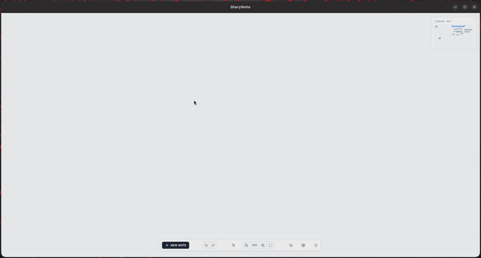
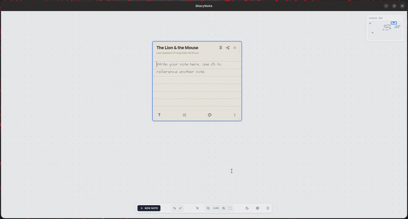
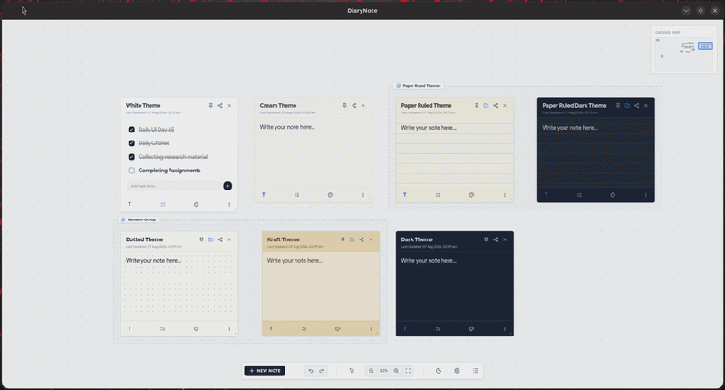
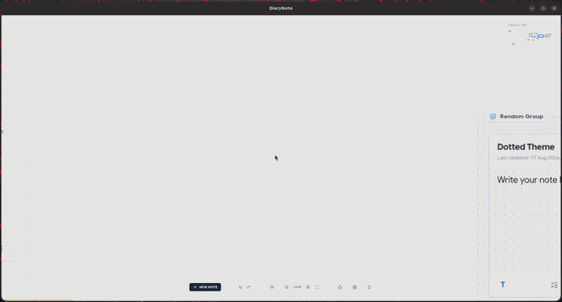

<div align="center">


# DiaryNote

An Infinite Spatial Canvas Note-Taking & Journaling Application built with React 18, TypeScript, Vite, TailwindCSS, SQLite/Dexie, and Tauri v2.

[](https://github.com/itshimelz/DiaryNote/releases/latest)
[](https://tauri.app)
[](https://react.dev)
[](https://www.typescriptlang.org)
[](https://dexie.org)
[](#system-requirements)
[](#license)

</div>

---

## Table of Contents

- [Overview](#overview)
- [Demo](#demo)
- [Features](#features)
- [Keyboard Shortcuts](#keyboard-shortcuts)
- [System Requirements](#system-requirements)
- [Installation Guide](#installation-guide)
- [Contributing](#contributing)
- [License](#license)

---

## Overview

**DiaryNote** is a privacy-focused infinite spatial canvas note-taking and journaling app built using **AI-Assisted Development** methodologies. It combines the freedom of a 2D canvas with local-first persistence, master passcode security, bi-directional `@Note` linking, markdown editing, and card grouping.


---

## Demo

<div align="center">

<table>
  <tr>
    <td align="center" width="50%">
      <b>Note Creation</b><br/><br/>
      
    </td>
    <td align="center" width="50%">
      <b>Writing & Formatting</b><br/><br/>
      
    </td>
  </tr>
  <tr>
    <td align="center" width="50%">
      <b>Grouping Notes</b><br/><br/>
      
    </td>
    <td align="center" width="50%">
      <b>Infinite Canvas Zoom & Pan</b><br/><br/>
      
    </td>
  </tr>
</table>

</div>

---

## Features

- **Infinite Spatial Canvas**: Pan across an endless workspace, zoom smoothly (0.15x–3.0x), and align notes with grid snappings and interactive minimap.
- **Rich Note Editing**: GFM Markdown and task checklist modes with custom paper themes, typography options, and card grouping frames.
- **Local-First & Secure**: 100% offline storage using local database persistence with optional SHA-256 master passcode protection for sensitive notes.
- **Bi-Directional Linking**: Link notes using `@Note` autocomplete and visualize relationships with dynamic SVG connection lines.

---

## Keyboard Shortcuts

Press `Ctrl + /` (or `Cmd + /`) inside the app to open the built-in hotkey cheat sheet.

| Shortcut | Category | Function |
| :--- | :--- | :--- |
| `Ctrl + /` | General | Open keyboard shortcuts reference |
| `Ctrl + K` / `/` | General | Search notes / Open command palette |
| `N` / `Ctrl + N` | Notes | Create a new note |
| `Enter` | Notes | Edit selected note |
| `Delete` / `Backspace` | Notes | Delete selected note(s) |
| `Ctrl + G` / `Ctrl + Shift + G` | Grouping | Group / Ungroup selected notes |
| `Ctrl + L` | Security | Lock / unlock selected note(s) |
| `Ctrl + Z` / `Ctrl + Y` | Canvas | Undo / Redo action |
| `F` | View | Fit all notes on canvas view |
| `H` | View | Reset zoom and center view |

---

## System Requirements

- **Linux**: Ubuntu 20.04+, Arch Linux, Fedora, Debian (WebKitGTK)
- **macOS**: 10.15 Catalina or newer
- **Windows**: Windows 10 / 11 (64-bit)

---

## Installation Guide

### One-Line Automatic Install

#### Linux & macOS
```bash
curl -fsSL https://raw.githubusercontent.com/itshimelz/DiaryNote/main/install.sh | bash
```

#### Windows (PowerShell)
```powershell
irm https://raw.githubusercontent.com/itshimelz/DiaryNote/main/install.ps1 | iex
```

---

### Prebuilt Packages

Download the latest prebuilt packages from [GitHub Releases](https://github.com/itshimelz/DiaryNote/releases/latest).

#### Debian / Ubuntu (`.deb`)
```bash
sudo dpkg -i DiaryNote_0.1.0_amd64.deb
```

#### Arch / Standalone Linux (`.tar.gz`)
```bash
tar -xvf DiaryNote-linux-x86_64.tar.gz
cd DiaryNote
./DiaryNote
```

---

### Building from Source

#### Prerequisites
- **Node.js**: `v18+` or `v20+`
- **npm**, **bun**, or **yarn**
- **Rust Toolchain**: `rustc` & `cargo` (for Tauri builds)

#### Build Steps

1. **Clone the Repository**:
   ```bash
   git clone https://github.com/itshimelz/DiaryNote.git
   cd DiaryNote
   ```

2. **Install Dependencies & Start Dev Mode**:
   ```bash
   npm install
   npm run dev
   ```

3. **Build Production Binary**:
   ```bash
   npm run tauri:build
   ```

---

## Contributing

Contributions are welcome! Please see [CONTRIBUTING.md](CONTRIBUTING.md) for details.

---

## License

Distributed under the MIT License. See [LICENSE](LICENSE) for details.

