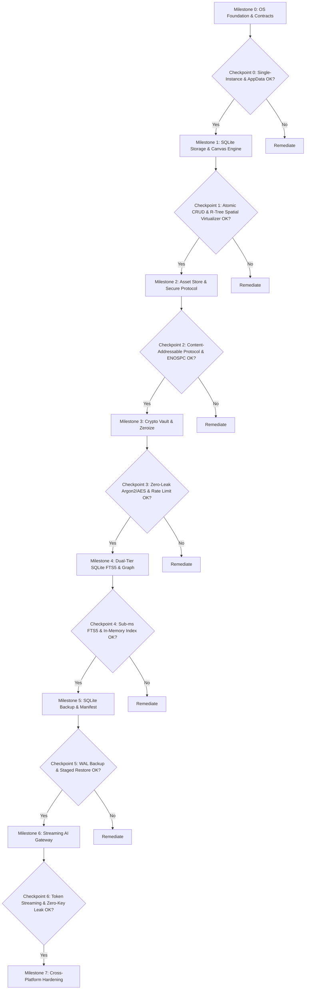

# DiaryNote Desktop — Checkpoint Milestones & Verification Guide
## Frozen Specification (v4.0.0)

**Document Version:** 4.0.0 (Frozen Architecture Baseline)  
**Target Platform:** Linux, macOS, Windows via Tauri v2 + Rust Core  
**Purpose:** Defines explicit test gates, acceptance criteria, failure recovery drills, and cross-platform verification checkpoints for every migration milestone.

---

## 1. Checkpoint Philosophy & Gate Rules

> [!IMPORTANT]
> **MANDATORY CHECKPOINT RULE:**
> No phase may begin until the preceding phase has cleared all automated tests, manual verification scripts, and edge-case failure drills documented below.
> Every checkpoint must leave the application in a **100% buildable, testable, and functional state**.

---

## 2. Milestone Checkpoint Matrix



---

## 3. Detailed Milestone Checkpoints & Verification Protocols

### Milestone 0: OS Foundation, Repository Contracts & Lifecycle
* **Target Subsystems:** Single-instance mutex, Tauri AppData path resolver, `NoteRepository` trait, typed error enums, window lifecycle interceptors.

#### Automated Test Suite:
```bash
cargo test --lib domain::note::repository
cargo test --lib infrastructure::os
```

#### Acceptance Criteria & Checkpoint Verification:
1. **Platform Path Resolution:**
   - Linux: Directory resolves to `$XDG_DATA_HOME/com.diarynote.desktop/` or `~/.local/share/com.diarynote.desktop/`.
   - macOS: Directory resolves to `~/Library/Application Support/com.diarynote.desktop/`.
   - Windows: Directory resolves to `%APPDATA%\com.diarynote.desktop\`.
2. **Single-Instance Test:**
   - Launch app instance #1.
   - Launch app instance #2 via terminal.
   - Verify instance #2 exits immediately ($0$ exit code) and brings instance #1 window to foreground.
3. **Repository Contract Isolation:**
   - `MockNoteRepository` unit tests run in memory without creating any disk artifacts.

---

### Milestone 1: Native SQLite Storage Engine & Client Canvas Engine
* **Target Subsystems:** `rusqlite` serialized connection with WAL mode, `001_initial_schema.sql` and `002_asset_tables.sql` migrations, atomic `save_notes_batch` transactions, `src/canvas/` spatial virtualizer (In-Memory R-Tree with dynamic overscan), TypeScript `rustStorage.ts` bridge, `useNotesManager` hydration.

#### Automated Test Suite:
```bash
cargo test --lib infrastructure::sqlite
npm test -- src/canvas/__tests__/spatialIndex.test.ts
npm test -- src/lib/__tests__/rustStorage.test.ts
npm run lint
```

#### Acceptance Criteria & Checkpoint Verification:
1. **WAL Initialization:**
   - Inspect database path: `diarynote.db`, `diarynote.db-wal`, `diarynote.db-shm` files are created.
   - Execute `PRAGMA journal_mode;` $\rightarrow$ returns `"wal"`.
2. **Atomic Batch Rollback Test:**
   - Trigger a batch save where 1 note contains invalid foreign key / corrupt data.
   - Verify zero notes in the batch are committed (full rollback).
3. **R-Tree Immediate Synchronization Test:**
   - Drag Note A $\rightarrow$ verify R-Tree coordinates update synchronously in the same frame without waiting for SQLite.
4. **Spatial Virtualization Frustum Test:**
   - In a vault with 1,000 mock notes, verify only $\sim 50–150$ NoteCards are mounted in the DOM.
5. **Graceful Shutdown Flush Drill:**
   - Modify a note's text $\rightarrow$ immediately press `Alt+F4` / close window within $100\text{ms}$.
   - Reopen application $\rightarrow$ verify latest modified text is $100\%$ intact.

---

### Milestone 2: Content-Addressable Asset Store & Custom Protocol
* **Target Subsystems:** SHA-256 disk storage, thumbnail generation (`image` crate), `diarynote-asset://` custom URI handler, path traversal security filter, ENOSPC handling.

#### Automated Test Suite:
```bash
cargo test --lib infrastructure::filesystem::asset_store
cargo test --lib commands::assets
```

#### Acceptance Criteria & Checkpoint Verification:
1. **Path Traversal Security Drill:**
   - Request `diarynote-asset://../../../../etc/passwd` $\rightarrow$ must return `400 Bad Request`.
   - Request `diarynote-asset://invalid_hash` $\rightarrow$ must return `400 Bad Request`.
   - Request non-existent 64-char hash $\rightarrow$ must return `404 Not Found`.
2. **Deduplication & Asset Integrity:**
   - Import same image 3 times $\rightarrow$ stored only once on disk under single SHA-256 hash.
   - Verify note JSON references `diarynote-asset://<hash>` and payload remains $< 2\text{KB}$.
3. **Disk-Full (ENOSPC) Simulation:**
   - Simulate write failure during image import $\rightarrow$ temporary staging file is purged, SQLite transaction aborts, and UI displays clear error banner without broken card state.

---

### Milestone 3: Hardware Cryptographic Vault & Memory Zeroization
* **Target Subsystems:** Argon2id key derivation, AES-256-GCM envelope encryption, `SessionVault` with `zeroize::ZeroizeOnDrop`, brute-force exponential backoff.

#### Automated Test Suite:
```bash
cargo test --lib infrastructure::crypto
cargo test --lib domain::vault
npm test -- src/services/__tests__/cryptoVaultService.test.ts
```

#### Acceptance Criteria & Checkpoint Verification:
1. **Zero Plaintext on Disk Drill:**
   - Lock a note containing `"Secret Project Codename"`.
   - Read SQLite database using `strings diarynote.db | grep "Secret Project Codename"` $\rightarrow$ zero matches found (pure `$aes-gcm$` ciphertext).
2. **Memory Wipe Verification (`Zeroize`):**
   - Unlock vault $\rightarrow$ note renders decrypted.
   - Lock vault $\rightarrow$ memory buffer is immediately overwritten with zeros.
   - Verify note cards revert to locked masked state.
3. **Rate Limiting & Exponential Backoff:**
   - Attempt 5 incorrect passcodes $\rightarrow$ verify 16s native backoff lock is enforced at the Rust level.

---

### Milestone 4: Dual-Tier SQLite FTS5 Search & Link Graph Engine
* **Target Subsystems:** Persistent SQLite FTS5 trigram virtual table, transient in-memory SQLite FTS5 index for unlocked vault notes, `pulldown-cmark` Markdown AST parser for mentions and backlinks.

#### Automated Test Suite:
```bash
cargo test --lib infrastructure::sqlite::fts
cargo test --lib domain::graph
cargo test --lib commands::search
```

#### Acceptance Criteria & Checkpoint Verification:
1. **Sub-Millisecond Multi-Language Search:**
   - Index 5,000 mock notes across English, Bengali, and CJK characters.
   - Query keywords via `search_notes` $\rightarrow$ returns BM25 ranked IDs in $< 2\text{ms}$.
2. **Dual-Tier Encryption Search Isolation:**
   - When vault is locked: search query for secret text returns $0$ results.
   - When vault is unlocked: secret note appears instantly in search results via memory FTS5.
   - When vault is re-locked: memory FTS connection is dropped, and secret note vanishes from search index immediately.
3. **Link Graph Generation:**
   - Create Note A containing `@[Note B]`.
   - Query `get_note_connections` $\rightarrow$ returns link `Note A -> Note B` in microseconds.

---

### Milestone 5: SQLite Online Backup & Archive Engine with Manifest
* **Target Subsystems:** SQLite Online Backup API (`rusqlite::backup`), WAL checkpointing, streaming `.diarynote` ZIP container with versioned `manifest.json`, duplicate resolution.

#### Automated Test Suite:
```bash
cargo test --lib infrastructure::filesystem::backup
cargo test --lib commands::backup
```

#### Acceptance Criteria & Checkpoint Verification:
1. **WAL-Consistent Backup Drill:**
   - Perform heavy concurrent writes while triggering `export_vault_archive`.
   - Verify resulting archive contains a 100% valid, uncorrupted SQLite snapshot without missing WAL transactions.
2. **Manifest Verification:**
   - Inspect extracted archive: verify `manifest.json` contains `format_version`, `schema_version`, `app_version`, and `asset_hashes`.
3. **Atomic Staged Restore:**
   - Import an archive containing 100 notes and 20 images $\rightarrow$ verify all notes and images restore cleanly.

---

### Milestone 6: Secure Streaming AI Gateway
* **Target Subsystems:** `reqwest` HTTP/2 client with streaming SSE, encrypted API key storage in backend, token event channel (`ai:stream-chunk`).

#### Automated Test Suite:
```bash
cargo test --lib infrastructure::network::ai_client
cargo test --lib commands::ai
```

#### Acceptance Criteria & Checkpoint Verification:
1. **Zero Credential Exposure:**
   - Open WebDevTools Network tab $\rightarrow$ verify zero third-party AI API calls are made from the browser (all network traffic routes through Rust binary).
2. **Real-Time Token Streaming:**
   - Trigger note synthesis $\rightarrow$ tokens stream into the note card smoothly at 30+ tokens/sec without UI freeze.

---

### Milestone 7: Cross-Platform Hardening & Release Readiness
* **Target Subsystems:** Static analysis, lint validation, memory leak checks, cross-platform build verification.

#### Quality Gate Checklist:
- [ ] `cargo test --all` passes 100% across all modules.
- [ ] `cargo check` outputs 0 warnings.
- [ ] `npm run lint` (`oxlint && tsc --noEmit`) outputs 0 errors and 0 warnings.
- [ ] `npm test` passes all frontend unit and integration test suites.
- [ ] UI Component Modification Registry in `AGENTS.md` is fully updated.
- [ ] Production package builds cleanly (`npm run build`).
