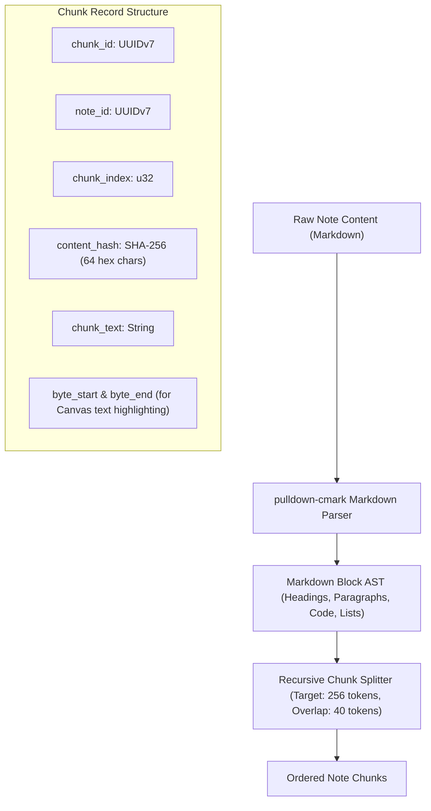
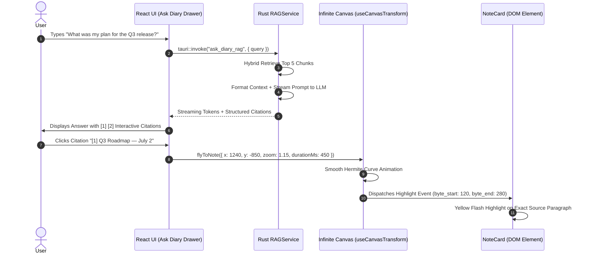

# DiaryNote Desktop — Local-First Hybrid Search & Spatial RAG Architecture
## Production Specification: Dual-Tier Lexical/Semantic Retrieval, Embedded Vector Indexing, and Canvas-Grounded Synthesis

**Document Version:** 1.0.0  
**Target Platforms:** Linux (XDG), macOS (Application Support), Windows (AppData/Roaming)  
**Parent Architecture Reference:** [RUST_NATIVE_MIGRATION_ARCHITECTURE.md](file:///home/itshimelz/Projects/DiaryNote/docs/RUST_NATIVE_MIGRATION_ARCHITECTURE.md)  
**Core Runtime:** Rust (`app_lib`) + SQLite (`rusqlite` + `sqlite-vec` + FTS5) + React 19 / TypeScript  
**Embedding Engine:** Local Native In-Process ONNX / `fastembed-rs` (Quantized, Zero Cloud Dependency)  
**Retrieval Model:** Hybrid Two-Stage (BM25 Lexical + Cosine Vector + Metadata Filtering + Reciprocal Rank Fusion)  
**Grounding Model:** Spatial Canvas Citations (Viewport Camera Animation to Note Coordinates)

---

## 1. Architectural Philosophy & Core Axioms

DiaryNote’s search and intelligence subsystem is built around personal privacy, offline autonomy, and spatial memory. It explicitly rejects the naive cloud-only pattern of "uploading user diary databases to third-party vector databases."

```text
┌─────────────────────────────────────────────────────────────────────────────┐
│                       LOCAL-FIRST HYBRID RAG AXIOMS                         │
├──────────────────────────────┬──────────────────────────────────────────────┤
│ 1. Zero Cloud Data Leaks     │ Notes never leave the local machine for      │
│    (Complete Data Ownership) │ search or indexing. Embeddings run locally.  │
├──────────────────────────────┼──────────────────────────────────────────────┤
│ 2. Tripartite Search Synergy │ • Semantic Search finds conceptual meaning.  │
│    (FTS5 + Vector + Filter)  │ • FTS5 / BM25 finds exact words and code.    │
│                              │ • Metadata filters scope spatial universe.   │
├──────────────────────────────┼──────────────────────────────────────────────┤
│ 3. Deterministic Separation  │ • "Search": Sub-15ms deterministic lookup.   │
│    (Search vs Ask DiaryNote) │ • "Ask Diary": Grounded RAG synthesis with   │
│                              │   strict source citations.                   │
├──────────────────────────────┼──────────────────────────────────────────────┤
│ 4. Visual Spatial Memory     │ Citations are not abstract footnotes; they   │
│    (Canvas Camera Flight)    │ are 2D spatial coordinates that zoom and pan │
│                              │ the canvas directly to the source NoteCard.  │
├──────────────────────────────┼──────────────────────────────────────────────┤
│ 5. Cryptographic Isolation   │ Locked vault notes are never indexed in      │
│    (AES-256-GCM + Zeroize)   │ plain text on disk. Vectors live in memory   │
│                              │ during session and are wiped on vault lock.  │
└──────────────────────────────┴──────────────────────────────────────────────┘
```

---

## 2. End-to-End System Architecture

```mermaid
graph TB
    subgraph Frontend_UI ["Frontend (React 19 + TypeScript)"]
        SearchModal["Global Search Modal (Ctrl+K)"]
        AskDiaryDrawer["Ask DiaryNote AI Panel (Cmd+J)"]
        InfiniteCanvas["Infinite Canvas Viewport (Camera Controller)"]
        NoteCard["NoteCard DOM Element (Active Highlight)"]
    end

    subgraph IPC_Layer ["Tauri v2 IPC Gateway"]
        Cmd_Search["tauri::invoke('search_notes_hybrid')"]
        Cmd_Ask["tauri::invoke('ask_diary_rag')"]
        Evt_Stream["app_handle.emit('rag_token_stream')"]
    end

    subgraph Rust_Search_Core ["Rust Core (app_lib::domain::search)"]
        SearchCoordinator["SearchCoordinator (Hybrid Pipeline Orchestrator)"]
        ChunkingEngine["ChunkingEngine (Markdown AST + SHA-256 Hashing)"]
        EmbeddingWorker["Local Embedding Worker (Background Thread)"]
        ScoreFusion["Score Fusion (Reciprocal Rank Fusion / RRF)"]
        Reranker["Local Cross-Encoder Reranker (Top 50 -> Top 10)"]
        RAGSynthesizer["RAGSynthesizer (Context Assembly + Citation Injector)"]
    end

    subgraph Storage_Engines ["Embedded Local Storage Subsystem"]
        subgraph Disk_Persistence ["Single Database File: diarynote.db"]
            Table_Notes["SQLite: notes (Metadata & Plaintext/Ciphertext)"]
            Table_Chunks["SQLite: note_chunks (Spatial & Position Index)"]
            FTS_Public["SQLite FTS5: notes_fts (Trigram Lexical Index)"]
            Vec_Public["sqlite-vec: vec_note_chunks (384-dim HNSW/Flat Index)"]
        end

        subgraph Memory_Vault ["Transient Decrypted Memory (ZeroizeOnDrop)"]
            FTS_Vault_Mem["In-Memory FTS5 (Unlocked Vault Notes)"]
            Vec_Vault_Mem["In-Memory HNSW Vector Index (Unlocked Vault Embeddings)"]
        end
    end

    SearchModal --> Cmd_Search
    AskDiaryDrawer --> Cmd_Ask
    Cmd_Search --> SearchCoordinator
    Cmd_Ask --> RAGSynthesizer

    SearchCoordinator --> FTS_Public
    SearchCoordinator --> Vec_Public
    SearchCoordinator --> FTS_Vault_Mem
    SearchCoordinator --> Vec_Vault_Mem
    SearchCoordinator --> ScoreFusion
    ScoreFusion --> Reranker

    Reranker --> SearchModal
    Reranker --> RAGSynthesizer
    RAGSynthesizer --> Evt_Stream
    Evt_Stream --> AskDiaryDrawer

    AskDiaryDrawer -->|Click Citation (note_id, chunk_x, chunk_y)| InfiniteCanvas
    InfiniteCanvas -->|Smooth Camera Zoom & Pan| NoteCard
```

---

## 3. Dual-Tier Cryptography & Vector Search Isolation

A critical challenge in desktop security is preventing encrypted vault notes from leaking information into plaintext search indexes. Embeddings and FTS tokens can reconstruct or approximate sensitive diary text if stored on disk without encryption.

### Security Architecture for Encrypted Notes

```text
                           NOTE PERSISTENCE EVENT
                                     │
                    Is Note Locked / Vault Protected?
                                     │
                   ┌─────────────────┴─────────────────┐
                   ▼                                   ▼
                [ NO ]                              [ YES ]
                   │                                   │
      ┌────────────┴────────────┐                      │
      ▼                         ▼                      ▼
 SQLite `notes`          Generate Hash &        Derive AES-256-GCM Key
(Plaintext Disk)            Embedding            via Argon2id Master Pass
      │                         │                      │
      ├─────────────────────────┤                      ▼
      ▼                         ▼               Store Ciphertext in
 SQLite FTS5               `sqlite-vec`            `notes` Table
(Disk Trigram)          (Disk Vector Table)            │
                                                       ▼
                                            [ VAULT UNLOCK EVENT ]
                                                       │
                                            Decrypt Note in Memory
                                                       │
                                        ┌──────────────┴──────────────┐
                                        ▼                             ▼
                               Transient In-Memory            Transient In-Memory
                                SQLite FTS5 Table              HNSW Vector Index
                                        │                             │
                                        └──────────────┬──────────────┘
                                                       ▼
                                            [ VAULT LOCK / TIMEOUT ]
                                                       │
                                            `zeroize::ZeroizeOnDrop`
                                            Wipes All Keys & Vectors
```

### Privacy Guarantees
1. **Zero Plaintext Vector on Disk:** Encrypted notes never produce vector rows in the disk-persisted `vec_note_chunks` table.
2. **Ephemeral Memory Indexing:** On vault unlock, embeddings for locked notes are computed (or decrypted from an AES-encrypted cache) and held strictly in a transient in-memory HNSW index.
3. **Hardware-Accelerated Zeroization:** On lock, window blur, or timeout (default 15 minutes), all decrypted chunk vectors, token trees, and derived keys invoke `zeroize::Zeroize` to scrub RAM.

---

## 4. Searchable Representation & Content-Addressable Chunking

### 4.1 Searchable Document Normalization
Before generating embeddings or lexical tokens, notes are converted into a standardized textual representation:

```text
Title: My Reflections on Systems Programming
Tags: rust, memory-safety, performance
Date: 2026-08-17
Mood: focused
Content:
Understanding RAII and ownership in Rust transformed how I think about resources...
```

### 4.2 Markdown-Aware Semantic Chunking Engine
Small notes ($<300$ words) are indexed as a single atomic chunk. Long-form journal entries ($>300$ words) undergo header- and paragraph-aware sliding window chunking to maintain retrieval resolution.



### 4.3 SHA-256 Content-Addressable Vector Cache
To prevent redundant local CPU/GPU cycles during active note editing:
1. When a chunk is extracted, compute `content_hash = SHA-256(title + "\n" + chunk_text + "\n" + tags)`.
2. Query `embeddings` table for matching `content_hash` and `model_id`.
3. If an embedding with the exact hash exists, reuse the existing vector and update the `chunk_id` mapping.
4. **Result:** If a user only alters metadata or fixes a typo in paragraph 4, paragraphs 1, 2, and 3 are **not re-embedded**.

---

## 5. Local Native Embedding & Inference Engine

### 5.1 Model Selection Criteria
The local embedding engine operates completely in-process within the native Rust backend using ONNX Runtime (`ort`) or `fastembed-rs`.

| Model Name | Dimensions | Parameters | Disk Size (Quantized) | Latency (CPU) | Context Window |
| :--- | :--- | :--- | :--- | :--- | :--- |
| **`bge-small-en-v1.5` (Default)** | 384 | 33M | ~32 MB (ONNX INT8) | ~12 ms / chunk | 512 tokens |
| **`all-MiniLM-L6-v2`** | 384 | 22M | ~23 MB (ONNX INT8) | ~8 ms / chunk | 256 tokens |
| **`multilingual-e5-small`** | 384 | 45M | ~45 MB (ONNX INT8) | ~18 ms / chunk | 512 tokens |
| **`nomic-embed-text-v1.5`** | 768 / Matryoshka | 137M | ~130 MB | ~35 ms / chunk | 2048 tokens |

### 5.2 Non-Blocking Background Embedding Worker
Note saves in SQLite WAL complete in $<5\text{ms}$. Embedding generation is dispatched asynchronously over an unbounded crossbeam channel to a dedicated background OS thread.

```text
User Types Note
      │
      ▼ (500ms debounce)
SQLite Transaction Commit (ACID Saved) ──► UI Status: "Saved"
      │
      ▼
Push `NoteDirtyEvent(note_id)` to Crossbeam Channel
      │
      ▼
┌────────────────────────────────────────────────────────┐
│ BACKGROUND EMBEDDING WORKER (Rust Thread)              │
│ 1. Read note chunks from SQLite                        │
│ 2. Compute SHA-256 content hashes                      │
│ 3. Filter chunks needing embedding calculation         │
│ 4. Batch encode via ONNX Runtime with hardware SIMD    │
│ 5. Insert vector into `vec_note_chunks` table          │
│ 6. Mark `note_chunks.embedding_status = 'completed'`   │
└────────────────────────────────────────────────────────┘
```

### 5.3 Model Schema Versioning & Upgrades
Vectors from different embedding models or versions are non-comparable. DiaryNote stores model metadata directly with every embedding row:

```rust
#[derive(Debug, Clone, Serialize, Deserialize)]
pub struct ModelMetadata {
    pub model_id: String,       // e.g., "bge-small-en-v1.5"
    pub dimension: usize,       // e.g., 384
    pub schema_version: u32,    // e.g., 1
}
```

If the user switches models in Preferences:
1. Existing embeddings are flagged `needs_reindex = true`.
2. A background migration incrementally computes new vectors without interrupting app responsiveness.
3. Once complete, active search switches atomically to the new index version.

---

## 6. Embedded Database Schema (`sqlite-vec` + FTS5)

All data, chunks, full-text indexes, and high-dimensional vector embeddings are stored inside the single portable `diarynote.db` SQLite database using the official **`sqlite-vec`** extension.

```sql
-- 1. Base Notes Table (Source of Truth)
CREATE TABLE IF NOT EXISTS notes (
    id TEXT PRIMARY KEY NOT NULL,             -- UUIDv7
    title TEXT NOT NULL DEFAULT '',
    content TEXT NOT NULL DEFAULT '',         -- Plaintext or AES-256-GCM Ciphertext
    tags TEXT NOT NULL DEFAULT '[]',          -- JSON Array of strings
    color TEXT NOT NULL DEFAULT 'default',
    x REAL NOT NULL DEFAULT 0.0,
    y REAL NOT NULL DEFAULT 0.0,
    width REAL NOT NULL DEFAULT 320.0,
    height REAL NOT NULL DEFAULT 240.0,
    is_pinned INTEGER NOT NULL DEFAULT 0,
    is_locked INTEGER NOT NULL DEFAULT 0,
    is_archived INTEGER NOT NULL DEFAULT 0,
    is_daily_entry INTEGER NOT NULL DEFAULT 0,
    entry_date TEXT,
    mood TEXT,
    created_timestamp INTEGER NOT NULL,
    updated_timestamp INTEGER NOT NULL
);

-- 2. Note Chunks Table (Sub-Document Segmentation)
CREATE TABLE IF NOT EXISTS note_chunks (
    id TEXT PRIMARY KEY NOT NULL,             -- UUIDv7
    note_id TEXT NOT NULL REFERENCES notes(id) ON DELETE CASCADE,
    chunk_index INTEGER NOT NULL,
    content_hash TEXT NOT NULL,               -- SHA-256 of searchable representation
    chunk_text TEXT NOT NULL,
    token_count INTEGER NOT NULL,
    byte_start INTEGER NOT NULL,              -- Character offset in parent note
    byte_end INTEGER NOT NULL,
    embedding_status TEXT NOT NULL DEFAULT 'pending', -- 'pending' | 'completed' | 'failed'
    created_timestamp INTEGER NOT NULL,
    UNIQUE(note_id, chunk_index)
);

CREATE INDEX IF NOT EXISTS idx_chunks_note_id ON note_chunks(note_id);
CREATE INDEX IF NOT EXISTS idx_chunks_hash ON note_chunks(content_hash);
CREATE INDEX IF NOT EXISTS idx_chunks_status ON note_chunks(embedding_status);

-- 3. Full-Text Search Virtual Table (Trigram Tokenizer)
CREATE VIRTUAL TABLE IF NOT EXISTS notes_fts USING fts5(
    id UNINDEXED,                             -- Note ID
    chunk_id UNINDEXED,                       -- Chunk ID
    title,
    content,
    tags,
    tokenize='trigram'
);

-- 4. Vector Virtual Table (sqlite-vec extension)
-- Dimensions = 384 (Matches bge-small-en-v1.5 / all-MiniLM-L6-v2)
CREATE VIRTUAL TABLE IF NOT EXISTS vec_note_chunks USING vec0(
    chunk_id TEXT PRIMARY KEY,
    embedding FLOAT[384] DISTANCE_METRIC=cosine
);

-- 5. Persistent Embedding Registry (Model & Content Deduplication Cache)
CREATE TABLE IF NOT EXISTS embedding_cache (
    content_hash TEXT NOT NULL,
    model_id TEXT NOT NULL,
    model_version INTEGER NOT NULL,
    dimension INTEGER NOT NULL,
    vector BLOB NOT NULL,                     -- Raw IEEE 754 float array bytes
    created_timestamp INTEGER NOT NULL,
    PRIMARY KEY(content_hash, model_id, model_version)
);
```

---

## 7. Two-Stage Hybrid Retrieval & Score Fusion

Hybrid search combines the strengths of exact lexical matching and semantic vector similarity, avoiding the pitfalls of both.

```text
Query: "Rust ownership CRUD mental model"
  │
  ├──► [Branch 1: Lexical Search (SQLite FTS5 Trigram)]
  │     Query: title, content, tags MATCH "Rust" OR "ownership" OR "CRUD"
  │     Returns: Top 30 candidate chunks with BM25 rank score.
  │
  ├──► [Branch 2: Semantic Search (Local Embedding + sqlite-vec)]
  │     Query Vector: encode("Rust ownership CRUD mental model")
  │     Returns: Top 30 candidate chunks with Cosine similarity score.
  │
  ├──► [Branch 3: Metadata Pre-Filtering]
  │     Filters: Date range (e.g. Last 30 days), Tags ("#rust"), Pinned, Unlocked.
  │
  ▼
[Score Fusion: Reciprocal Rank Fusion (RRF)]
  Combines ranks without requiring artificial score calibration:
  RRF_Score(d) = (w_fts / (k + rank_fts(d))) + (w_vec / (k + rank_vec(d))) + metadata_bonus
  │
  ▼
[Deduplication & Note-Level Aggregation]
  Group top 50 chunks by parent `note_id`.
  Note Score = max(chunk_score) + 0.1 * sum(secondary_chunk_scores).
  │
  ▼
[Optional Stage 2: Cross-Encoder Reranker (Top 50 -> Top 10)]
  Lightweight local cross-encoder validates query-document token interactions.
  │
  ▼
[Final Top 10 Ranked Results with Exact Snippets & Canvas Coordinates]
```

### Reciprocal Rank Fusion (RRF) Formulation

$$\text{RRF}(d \in D) = \frac{w_{\text{lex}}}{k + \text{rank}_{\text{lex}}(d)} + \frac{w_{\text{sem}}}{k + \text{rank}_{\text{sem}}(d)} + \text{RecencyBonus}(d)$$

Where:
* $k = 60$ (Standard smoothing constant preventing top ranks from dominating).
* $w_{\text{lex}} = 0.40$ (BM25 lexical weight).
* $w_{\text{sem}} = 0.60$ (Vector cosine semantic weight).
* $\text{RecencyBonus}(d) = 0.05 \times \frac{1}{1 + \Delta\text{days} / 30}$.

---

## 8. "Ask DiaryNote" — Grounded Local RAG with Spatial Citations

### 8.1 Distinct Features: "Search" vs "Ask DiaryNote"

```text
┌──────────────────────────────────────┬──────────────────────────────────────┐
│ GLOBAL SEARCH (Ctrl+K)               │ ASK DIARYNOTE (Cmd+J)                │
├──────────────────────────────────────┼──────────────────────────────────────┤
│ • Objective: Find cards fast.        │ • Objective: Synthesize answers.     │
│ • Execution: Sub-15ms Rust pipeline. │ • Execution: Hybrid RAG + Streaming. │
│ • Output: List of cards & snippets.  │ • Output: Natural prose + Citations. │
│ • Offline Requirement: 100% Offline. │ • Offline Requirement: Local SLM or  │
│                                      │   User API Key (Claude/Gemini/Ollama)│
└──────────────────────────────────────┴──────────────────────────────────────┘
```

### 8.2 Citation-to-Canvas Spatial Navigation Protocol

A unique innovation of DiaryNote is connecting RAG citations to the visual 2D Infinite Canvas.



---

## 9. Rust Hexagonal Architecture & Code Contracts

### 9.1 Module Layout in `app_lib`

```text
src-tauri/src/
├── domain/
│   ├── models/
│   │   ├── note.rs
│   │   ├── chunk.rs
│   │   └── search.rs
│   └── ports/
│       ├── embedding_engine.rs
│       ├── vector_store.rs
│       ├── search_repository.rs
│       └── rag_synthesizer.rs
├── infrastructure/
│   ├── embeddings/
│   │   ├── onnx_engine.rs            -- Local FastEmbed / ONNX Runtime
│   │   └── mock_engine.rs
│   ├── search/
│   │   ├── sqlite_vec_store.rs       -- sqlite-vec adapter
│   │   ├── fts5_search_adapter.rs    -- SQLite FTS5 adapter
│   │   └── hybrid_coordinator.rs     -- RRF Score fusion
│   └── rag/
│       ├── context_builder.rs
│       └── local_or_remote_llm.rs
└── commands/
    ├── search_commands.rs
    └── rag_commands.rs
```

### 9.2 Rust Port Interfaces

```rust
// domain/ports/embedding_engine.rs
use async_trait::async_trait;
use thiserror::Error;

#[derive(Error, Debug)]
pub enum EmbeddingError {
    #[error("ONNX model initialization failed: {0}")]
    InitError(String),
    #[error("Inference execution failed: {0}")]
    InferenceError(String),
    #[error("Tokenization overflow: length {0} exceeds max tokens {1}")]
    TokenizationError(usize, usize),
}

#[async_trait]
pub trait EmbeddingEngine: Send + Sync {
    fn model_id(&self) -> &str;
    fn dimension(&self) -> usize;
    async fn embed_text(&self, text: &str) -> Result<Vec<f32>, EmbeddingError>;
    async fn embed_batch(&self, texts: &[String]) -> Result<Vec<Vec<f32>>, EmbeddingError>;
}

// domain/ports/vector_store.rs
#[derive(Debug, Clone, Serialize, Deserialize)]
pub struct VectorMatch {
    pub chunk_id: String,
    pub note_id: String,
    pub distance: f32,          // Cosine distance (0.0 = identical)
    pub similarity: f32,        // 1.0 - distance
}

#[async_trait]
pub trait VectorStore: Send + Sync {
    async fn insert_vector(&self, chunk_id: &str, vector: &[f32]) -> Result<(), StorageError>;
    async fn search_vectors(&self, query_vector: &[f32], limit: usize) -> Result<Vec<VectorMatch>, StorageError>;
    async fn delete_vector(&self, chunk_id: &str) -> Result<(), StorageError>;
    async fn delete_vectors_by_note(&self, note_id: &str) -> Result<(), StorageError>;
}
```

### 9.3 Hybrid Search Domain Service

```rust
// domain/services/hybrid_search_service.rs
pub struct HybridSearchService {
    fts: Arc<dyn FtsRepository>,
    vector_store: Arc<dyn VectorStore>,
    embedding_engine: Arc<dyn EmbeddingEngine>,
    note_repo: Arc<dyn NoteRepository>,
}

impl HybridSearchService {
    pub async fn search(&self, query: &str, filter: SearchFilter) -> Result<Vec<SearchResult>, SearchError> {
        let query_trimmed = query.trim();
        if query_trimmed.is_empty() {
            return Ok(Vec::new());
        }

        // 1. Generate query embedding concurrently with FTS search
        let query_vector_fut = self.embedding_engine.embed_text(query_trimmed);
        let fts_fut = self.fts.search_bm25(query_trimmed, 30);

        let (query_vector_res, fts_res) = tokio::join!(query_vector_fut, fts_fut);
        let query_vector = query_vector_res?;
        let fts_matches = fts_res?;

        // 2. Perform vector search using sqlite-vec
        let vector_matches = self.vector_store.search_vectors(&query_vector, 30).await?;

        // 3. Reciprocal Rank Fusion (RRF)
        let fused_chunks = self.fuse_ranks(&fts_matches, &vector_matches, 60);

        // 4. Group by note_id and attach spatial coordinates
        let note_results = self.hydrate_note_results(fused_chunks, filter).await?;

        Ok(note_results)
    }

    fn fuse_ranks(&self, fts: &[FtsMatch], vec: &[VectorMatch], k: usize) -> Vec<FusedChunk> {
        let mut score_map: HashMap<String, FusedScore> = HashMap::new();

        for (rank, m) in fts.iter().enumerate() {
            let entry = score_map.entry(m.chunk_id.clone()).or_insert_with(|| FusedScore::new(&m.note_id));
            entry.rrf_score += 0.40 / (k as f32 + (rank + 1) as f32);
            entry.fts_snippet = Some(m.snippet.clone());
        }

        for (rank, m) in vec.iter().enumerate() {
            let entry = score_map.entry(m.chunk_id.clone()).or_insert_with(|| FusedScore::new(&m.note_id));
            entry.rrf_score += 0.60 / (k as f32 + (rank + 1) as f32);
            entry.semantic_similarity = Some(m.similarity);
        }

        let mut results: Vec<FusedChunk> = score_map.into_iter().map(|(chunk_id, score)| {
            FusedChunk { chunk_id, note_id: score.note_id, rrf_score: score.rrf_score, snippet: score.fts_snippet }
        }).collect();

        results.sort_by(|a, b| b.rrf_score.partial_cmp(&a.rrf_score).unwrap_or(std::cmp::Ordering::Equal));
        results
    }
}
```

---

## 10. Technology Selection Matrix

| Problem Space | Selected Architecture / Technology | Rationale & Alternatives Rejected |
| :--- | :--- | :--- |
| **Vector Indexing Engine** | Embedded `sqlite-vec` (C-extension / rusqlite) | **Chosen:** Single database file, zero daemon process, ACID with SQLite transactions.<br>**Rejected:** Qdrant/Milvus (external process overhead, backup sync nightmare). |
| **Local Embedding Model** | `bge-small-en-v1.5` ONNX INT8 (via `ort` / `fastembed-rs`) | **Chosen:** 32MB disk size, 384-dim, ~12ms latency, exceptional MTEB retrieval benchmark score.<br>**Rejected:** OpenAI Ada/3 (cloud dependency, monthly API cost, privacy leakage). |
| **Full-Text Lexical Engine** | SQLite FTS5 (Trigram Tokenizer) | **Chosen:** Substring matching, code/IME/Bangla search support, zero external index files.<br>**Rejected:** Tantivy on-disk (split-brain file management, dual backup sync). |
| **Rank Fusion Algorithm** | Reciprocal Rank Fusion (RRF, $k=60$) | **Chosen:** Robust against raw score scale differences between BM25 $[0, \infty)$ and Cosine $[0, 1]$. |
| **Encrypted Vault Index** | In-Memory `hnsw_rs` + `zeroize` | **Chosen:** Zero plaintext vector leakage to disk; instantaneous memory wipe on vault lock. |
| **Spatial Citation Link** | React `useCanvasTransform` Hermite Camera Easing | **Chosen:** Connects cognitive RAG synthesis directly to visual 2D spatial memory cards. |

---

## 11. Implementation Roadmap (Phases 1 to 8)

```text
Phase 1: Database Schema & sqlite-vec Integration
  ├── Compile & link sqlite-vec C extension into rusqlite connection pool
  ├── Execute versioned migration for `note_chunks`, `vec_note_chunks`, and `embedding_cache`
  └── Write unit tests validating 384-dim cosine distance calculation in SQLite

Phase 2: Searchable Representation & Markdown Chunking Engine
  ├── Implement pulldown-cmark AST block parser in Rust
  ├── Build sliding window chunker (256-token target, 40-token overlap, byte range offsets)
  └── Implement SHA-256 content-addressable hash deduplication engine

Phase 3: Local In-Process Embedding Engine & Background Worker
  ├── Bundle quantized `bge-small-en-v1.5` ONNX model in app assets
  ├── Implement `FastEmbedAdapter` using ONNX Runtime with hardware SIMD acceleration
  └── Build crossbeam background worker thread with dirty note queue and failure retries

Phase 4: Hybrid Search Engine & Reciprocal Rank Fusion
  ├── Implement FTS5 Trigram query builder with tag and date pre-filters
  ├── Implement parallel tokio::join lexical + vector retrieval
  ├── Implement RRF ($k=60$) rank fusion and note aggregation algorithm
  └── Expose `search_notes_hybrid` Tauri command and connect `SearchModal.tsx`

Phase 5: Dual-Tier Cryptographic Vault Search Alignment
  ├── Wire vault unlock event to decrypt and index protected notes in transient memory
  ├── Implement transient in-memory HNSW index for locked vault chunks
  └── Wire vault lock event to `zeroize::Zeroize` memory buffers and drop vector pointers

Phase 6: Spatial Grounding & Canvas Camera Navigation
  ├── Add `chunk_id`, `byte_start`, and `byte_end` highlight coordinates to search payloads
  ├── Wire search result selection to `useCanvasTransform.flyToNote()`
  └── Implement text snippet highlight pulsing effect in `NoteCard.tsx`

Phase 7: "Ask DiaryNote" RAG Synthesis Pipeline
  ├── Build structured context prompt assembler with strict citation tagging (`[1]`, `[2]`)
  ├── Implement SSE streaming client supporting Local SLM (Ollama/LocalAI) and user API keys
  ├── Build `AskDiaryDrawer.tsx` with streaming markdown and clickable citation badges
  └── Wire citation click directly to canvas camera flight and note focusing

Phase 8: Cross-Platform Hardening, Benchmarking & Packaging
  ├── Verify ONNX Runtime dynamic linking across Linux (XDG), macOS (Metal/ARM), and Windows
  ├── Benchmark memory footprint ($<80\text{MB}$ worker RAM) and query latency ($<20\text{ms}$)
  └── Document operations in `AGENTS.md` and verify zero lint/test regressions
```

---

## 12. Verification, Latency & Resource Budgets

```text
┌─────────────────────────────────────────────────────────────────────────────┐
│                 PERFORMANCE & RESOURCE BUDGET SPECIFICATION                 │
├──────────────────────────────┬───────────────────┬──────────────────────────┤
│ METRIC                       │ TARGET BUDGET     │ VERIFICATION METHOD      │
├──────────────────────────────┼───────────────────┼──────────────────────────┤
│ FTS5 Trigram Lexical Search  │ < 5 ms (10k notes)│ SQLite EXPLAIN QUERY PLAN│
├──────────────────────────────┼───────────────────┼──────────────────────────┤
│ `sqlite-vec` Vector Lookup   │ < 12 ms (50k chks)│ Criterion.rs benchmarks  │
├──────────────────────────────┼───────────────────┼──────────────────────────┤
│ Hybrid Fusion & Deduplication│ < 3 ms            │ In-memory Rust benchmark │
├──────────────────────────────┼───────────────────┼──────────────────────────┤
│ Single Chunk Embedding (CPU) │ < 15 ms / chunk   │ ONNX Runtime INT8 SIMD   │
├──────────────────────────────┼───────────────────┼──────────────────────────┤
│ Background Worker Idle RAM   │ < 40 MB           │ Linux `ps` / macOS Instruments│
├──────────────────────────────┼───────────────────┼──────────────────────────┤
│ Active Batch Embedding RAM   │ < 85 MB           │ Memory profiler peak     │
├──────────────────────────────┼───────────────────┼──────────────────────────┤
│ Total Database Disk Overhead │ < 18% of DB size  │ 384-dim INT8 vectors     │
├──────────────────────────────┼───────────────────┼──────────────────────────┤
│ Canvas Camera Flight Latency │ 60/120 FPS        │ Chrome DevTools FPS meter│
└──────────────────────────────┴───────────────────┴──────────────────────────┘
```

---

## 13. Summary: Why This Architecture Wins

1. **True Personal Privacy:** By embedding and indexing entirely in local Rust and embedded SQLite, user personal reflections and private thoughts never traverse third-party networks.
2. **Deterministic & Fast:** Traditional search remains instant ($<15\text{ms}$) and keyword-accurate via FTS5, while semantic search captures underlying intent.
3. **Spatial Continuity:** Unlike abstract chat interfaces, DiaryNote grounds every retrieved chunk in the physical 2D coordinates of the user's infinite canvas, reinforcing cognitive recall and visual organization.
