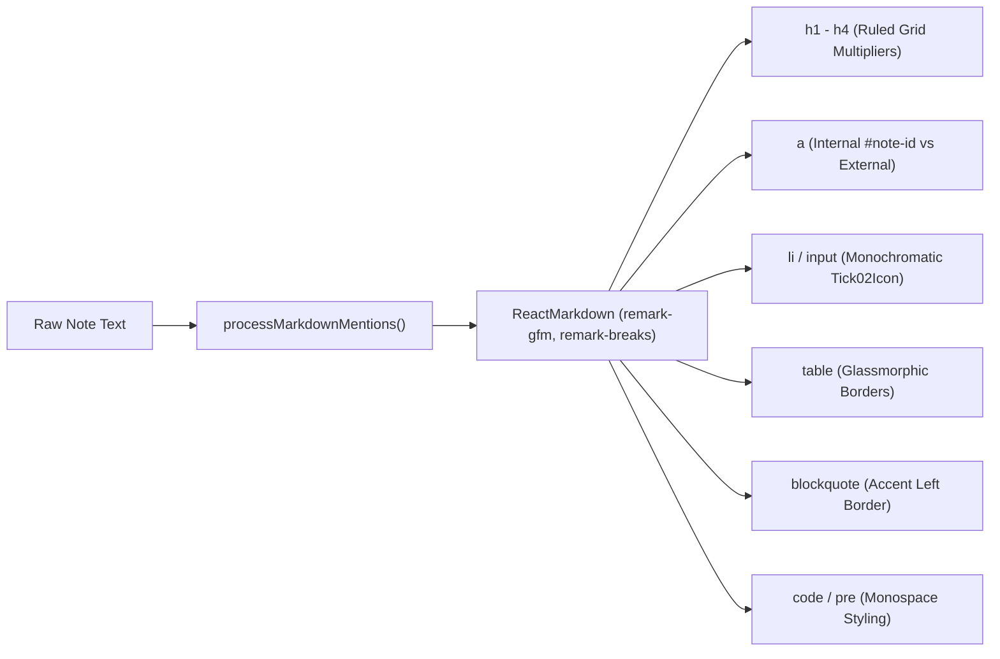
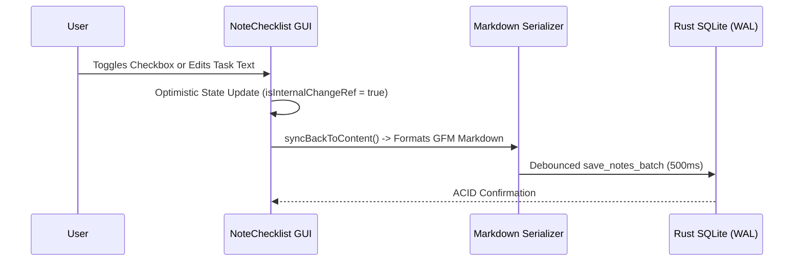

# DiaryNote Hybrid Markdown Engine & Rendering Architecture
## High-Performance Native Rust & React Specification (v4.0.0)

**Document Version:** 4.0.0  
**Target Platform:** Desktop Native (Tauri v2 + Rust Core + React 19 + TypeScript)  
**Backend Storage:** Authoritative Native Rust SQLite (WAL Mode) — Pure Rust Core (Zero IndexedDB)  
**Rust Markdown Core:** Streaming `pulldown-cmark` (v0.12) AST & Event Parser  
**Frontend Markdown Engine:** Dual-Tier React Presentation + Zero-AST Inline Scanner + Spatial Virtualization  
**Stationery Alignment:** Invariant Ruled Paper Baseline Grid Physics  

---

## 1. Architectural Overview & Core Invariants

DiaryNote combines the safety and parsing throughput of **Native Rust** with the reactive presentation layer of **React 19**, centered around a **Plain Markdown Single Source of Truth**:

1. **Pure Rust Backend & Storage Authoritativeness:**
   * All note persistence, database queries, full-text indexing, cryptographic vaults, and filesystem/OS operations reside strictly in the native Rust core (`app_lib`).
   * Notes are stored in SQLite 3 (`diarynote.db` in WAL mode) as canonical UTF-8 Markdown text (`content: TEXT`). There are zero proprietary AST binary blobs or opaque rich-text JSON structures.
   * **Zero IndexedDB Dependency:** The application does not rely on browser IndexedDB for persistence. All CRUD operations flow over typed Tauri IPC bridges to native Rust domain services.

2. **Dual-Tier High-Performance Rendering Model:**
   * **Tier 1 (Fast-Path Micro-Scanner):** Pure regex/stream inline tokenizer for short strings, task checklist rows, and single-line previews. Bypasses the heavy JavaScript Markdown AST pipeline completely, reducing CPU utilization and garbage collection churn by $>85\%$.
   * **Tier 2 (Full Component AST Renderer):** Memoized AST parser utilizing `react-markdown` + `remark-gfm` + `remark-breaks` with custom component mapping for complex markdown features (GFM tables, task lists, code blocks, blockquotes, internal `#note-id` routing).

3. **Sub-Millisecond Input Latency ($< 8\text{ms}$):**
   * Live editing occurs in a dedicated native textarea powered by pure functional text transformation algorithms (`noteTextEngine.ts`), ensuring instantaneous keystroke-to-paint response.

4. **Zero-Knowledge Security Invariant:**
   * Unauthenticated locked notes (`enc:v1:...`) are strictly omitted from public graph link indexing, backlink previews, and unauthenticated FTS index passes inside the Rust backend.

```mermaid
flowchart TD
    subgraph Rust_Native_Core ["Native Rust Backend Core (app_lib)"]
        SQLite["SQLite 3 (diarynote.db in WAL mode)"] <--> NoteService["domain::note::NoteService"]
        NoteService --> PulldownCmark["pulldown-cmark (Streaming Event AST)"]
        PulldownCmark --> GraphParser["domain::graph::parser (Links / Mentions / Tags)"]
        PulldownCmark --> FTS5Indexer["domain::search (SQLite FTS5 Plaintext Extractor)"]
        PulldownCmark --> ExportEngine["commands::export (Native HTML / PDF / MD)"]
        GraphParser --> ZeroKnowledgeFilter{"Is Target Locked?"}
        ZeroKnowledgeFilter -- Yes --> RedactEdge["Redact Edge / Context"]
        ZeroKnowledgeFilter -- No --> GraphConnections["Public Graph Connections & Backlinks"]
    end

    Rust_Native_Core <==>|Typed Tauri IPC (rustGraph, rustStorage, rustSearch)| React_Frontend

    subgraph React_Frontend ["React 19 Frontend (Client Presentation)"]
        RawContent["Canonical Markdown (note.content: string)"] --> Normalizer["normalizeNoteText() (CRLF -> LF)"]
        Normalizer --> RenderDispatcher{"Content Complexity & View Mode"}

        RenderDispatcher -- "Inline / Checklist Item" --> Tier1["Tier 1: Fast-Path Micro-Renderer (Zero AST Overhead)"]
        RenderDispatcher -- "Card Preview / Rich MD" --> Tier2["Tier 2: BaseMarkdownRenderer (Remark GFM + Custom Elements)"]
        RenderDispatcher -- "Active Editing" --> LiveEditor["Live Textarea Engine (noteTextEngine.ts)"]

        subgraph Spatial_Virtualizer ["Spatial Virtualizer (src/canvas/)"]
            RTree["In-Memory R-Tree (rbush)"] --> ViewportCulling["Frustum Culling (Overscan Buffer)"]
        end

        Tier2 --> ViewportCulling
        ViewportCulling --> CanvasDOM["Active NoteCard DOM (~50-200 nodes)"]
    end
```

---

## 2. Native Rust Markdown Pipeline (`app_lib`)

The native Rust backend (`src-tauri/src/`) provides microsecond-grade parsing, bidirectional graph link calculation, full-text search indexing, and security boundaries.

### 2.1 Streaming Event Parsing with `pulldown-cmark`
In [`src-tauri/src/domain/graph/parser.rs`](file:///home/itshimelz/Projects/DiaryNote/src-tauri/src/domain/graph/parser.rs), DiaryNote processes Markdown content via `pulldown-cmark` (v0.12) with zero memory allocations for standard CommonMark tokens:

```rust
use pulldown_cmark::{Event, Parser, Tag, TagEnd};
use serde::{Deserialize, Serialize};
use ts_rs::TS;

#[derive(Debug, Clone, Default, PartialEq, Eq, Serialize, Deserialize, TS)]
#[ts(export, export_to = "../../src/types/generated/")]
#[serde(rename_all = "camelCase")]
pub struct ParsedLinks {
    pub mentions: Vec<String>,
    pub mention_links: Vec<MentionLink>,
    pub wikilinks: Vec<String>,
    pub tags: Vec<String>,
    pub markdown_links: Vec<MarkdownLink>,
}
```

### 2.2 Link & Reference Extraction Heuristics
The parser executes a dual-phase extraction pipeline:
1. **Fast Manual Byte Scanner for Non-Standard Notation:**
   * `@mentions`: Scans for `@[Target Title](explicit-note-id)` and `@[Target Title]`.
   * `[[wikilinks]]`: Scans for `[[Target]]` or `[[Target|Alias]]`.
   * `#tags`: Scans for `#tag-name` tokens respecting word boundaries.
2. **Streaming Event Pull Parser for Standard Markdown:**
   * Detects markdown links `[text](url)` and `#note-id` internal anchors during `Event::Start(Tag::Link { dest_url, .. })` without building heavy heap-allocated AST trees.

### 2.3 Zero-Knowledge Locked Note Protection
In [`src-tauri/src/domain/graph/service.rs`](file:///home/itshimelz/Projects/DiaryNote/src-tauri/src/domain/graph/service.rs), the graph calculation strictly enforces zero-knowledge isolation:
* If `note.is_locked == true` and its content starts with the ciphertext header `enc:v1:`, the backend **skips ciphertext parsing** entirely.
* If a public note contains a mention pointing to a locked note ID (`target_is_locked == true`), the directed edge is **omitted from the public graph connections** and backlink context snippets are sanitized to `"Locked Note Content"`.

### 2.4 SQLite FTS5 Search Integration
Before indexing markdown content into the persistent SQLite `notes_fts` table, Rust strips markdown syntactic markup (`#`, `**`, `~~`, `` ` ``, `|`) into clean plaintext, allowing the `trigram` tokenizer to compute high-accuracy BM25 search rankings without punctuation pollution.

---

## 3. Client-Side Dual-Tier Rendering Engine

### 3.1 Tier 1: Fast-Path Zero-AST Micro-Scanner
For short inline strings (e.g., task rows in [`NoteChecklist.tsx`](file:///home/itshimelz/Projects/DiaryNote/src/components/NoteCard/NoteChecklist.tsx) and [`SmartMarkdownText.tsx`](file:///home/itshimelz/Projects/DiaryNote/src/components/NoteCard/SmartMarkdownText.tsx)):
* When content contains no complex markdown syntax, the renderer bypasses the Remark AST parser completely:
  ```typescript
  const isPlainInlineText = useMemo(
    () => inline && !/[[*`_~#@\\]/.test(processedContent),
    [inline, processedContent]
  );
  ```
* This eliminates the execution of multiple nested `ReactMarkdown` instances per checklist card, freeing main-thread CPU time for 120 FPS canvas zooming and panning.

### 3.2 Tier 2: Component AST Renderer (`BaseMarkdownRenderer.tsx`)
When rendering full note cards on the canvas, [`BaseMarkdownRenderer.tsx`](file:///home/itshimelz/Projects/DiaryNote/src/components/NoteCard/BaseMarkdownRenderer.tsx) executes a memoized `ReactMarkdown` pipeline with custom component adapters:



#### Custom Component Mapping Specifications:
1. **Internal Routing Links vs External URLs (`<a>`):**
   * Detects `href` starting with `#note-` and renders an interactive button that pans the canvas camera to the target note without page reloads.
   * External links open in default OS browsers with `target="_blank"` and `rel="noopener noreferrer"`.
2. **Custom Checkboxes & Task List Items (`<li>`, `<input type="checkbox">`):**
   * Replaces browser default checkboxes with tactile monochromatic rounded boxes containing the Hugeicons `Tick02Icon`.
   * Strips standard unordered list bullets (`list-none`) and aligns task text vertically with the checkbox.
3. **GFM Tables, Quotes & Code:**
   * Tables feature horizontal scroll wrappers (`overflow-x-auto`) with theme-adaptive borders (`border-slate-300/60 dark:border-slate-700/60`).
   * Blockquotes render with a 3px accent left border (`border-l-3 border-blue-500/70`).
   * Code blocks feature monospace typography with `whitespace-pre-wrap` and selectable text cursors.

---

## 4. Stationery & Ruled Paper Baseline Physics

> [!NOTE]
> DiaryNote features authentic stationery notebook aesthetics (`ruled` and `ruled-dark`). The mathematical alignment between text lines and horizontal notebook rules is strictly preserved.

### 4.1 CSS Grid & Variable Definition
Notebook lines are defined in [`src/index.css`](file:///home/itshimelz/Projects/DiaryNote/src/index.css) using repeating linear gradients pegged to `--ruled-line-height`:

$$\text{Line Height Table} = \begin{cases}
22\text{px} & \text{for } \texttt{text-xs} \\
24\text{px} & \text{for } \texttt{text-sm} \\
28\text{px} & \text{for } \texttt{text-base / md (Default)} \\
32\text{px} & \text{for } \texttt{text-lg} \\
36\text{px} & \text{for } \texttt{text-xl}
\end{cases}$$

### 4.2 Heading Baseline Multipliers
To prevent headings from breaking the vertical rhythm of notebook lines, headings enforce exact integer multipliers of `--ruled-line-height`:
* Paragraphs, lists, and quotes: `line-height: var(--ruled-line-height, 28px) !important;`
* Heading 1 (`h1`): `line-height: calc(var(--ruled-line-height, 28px) * 2) !important;`
* Dividers (`hr`): `height: 32px;` in ruled mode to match baseline increments.

---

## 5. Live Markdown Editor Engine (`noteTextEngine.ts`)

During active editing, [`NoteCard/index.tsx`](file:///home/itshimelz/Projects/DiaryNote/src/components/NoteCard/index.tsx) mounts a single high-performance native `<textarea>` powered by pure functional algorithms in [`src/utils/noteTextEngine.ts`](file:///home/itshimelz/Projects/DiaryNote/src/utils/noteTextEngine.ts).

### 5.1 Formatting Wrappers & Toggle Shortcuts (`applyMarkdownFormatting`)
Supports instant keyboard shortcuts with automatic wrap/unwrap toggling:

| Shortcut | Action | Prefix / Suffix | Default Placeholder |
| :--- | :--- | :--- | :--- |
| `Ctrl+B` / `Cmd+B` | Bold | `**` ... `**` | `bold text` |
| `Ctrl+I` / `Cmd+I` | Italic | `*` ... `*` | `italic text` |
| `Ctrl+Shift+X` | Strikethrough | `~~` ... `~~` | `strikethrough text` |
| `Ctrl+E` / `Ctrl+\`` | Inline Code | `` ` `` ... `` ` `` | `code` |
| Shortcut Menu | Code Block | ```` ```\n ```` ... ```` \n``` ```` | `code block` |
| Shortcut Menu | Blockquote | `> ` ... ` ` | `quote` |
| `Ctrl+K` | Link | `[` ... `](url)` | `link text` |

* **Toggle Intelligence:** If selected text is already wrapped in prefix/suffix markers, the function strips the markers rather than double-wrapping.

### 5.2 Smart List Continuation (`handleSmartEnterList`)
Pressing `Enter` inspects the line preceding the cursor:
1. **Numbered Lists (`1. `, `  2. `):** Parses current index, increments by 1 (`3. `), and preserves leading indentation.
2. **Checklists (`- [ ] `, `* [x] `):** Inserts a new unchecked `- [ ] ` item on the next line.
3. **Bullet Lists (`- `, `* `, `+ `):** Continues bullet item with matching indentation.
4. **List Termination:** If `Enter` is pressed on an empty list prefix, the prefix is stripped and list mode exits cleanly.

### 5.3 Tab & Shift+Tab Indentation
* `Tab`: Inserts 2 spaces (`  `) at cursor position.
* `Shift+Tab`: Strips up to 2 leading spaces from the current line.

---

## 6. Contextual Autocomplete & Slash Commands

### 6.1 Contextual Slash Commands (`SlashCommandMenu.tsx`)
Typing `/` opens the floating command palette:
* Headings: `/h1`, `/h2`, `/h3`
* Task & Lists: `/todo` (`- [ ] `), `/bullet` (`- `), `/number` (`1. `)
* Blocks: `/callout` (`> `), `/code` (```` ``` ````), `/divider` (`---`)
* Utilities: `/date` (localized timestamp), `/autotag` (AI-generated tag metadata)
* **Collision Detection:** Automatically calculates viewport boundaries and flips above the cursor line if near the bottom edge of the card.

### 6.2 Bidirectional Mentions (`MentionAutocomplete.tsx` & `markdownMention.ts`)
* Typing `@` displays note suggestions indexed via an $O(1)$ Hash Map (`idMap` & `titleMap`).
* Selecting a note inserts `@[Note Title](note-id)` into the plain text.

---

## 7. Dual-Mode Checklist GUI Synchronization (`NoteChecklist.tsx`)

In Checklist Mode, note cards present a structured task list with two-way Markdown synchronization:



* **Loop Guard (`isInternalChangeRef`):** Prevents local user keystrokes from triggering cyclic re-parsing passes.
* **Heading Preservation:** Section headings (`# Heading`) are parsed and rendered as visual dividers, maintaining hierarchical structure in plain markdown.

---

## 8. Spatial Virtualization & Memory Management

To maintain fluid 60/120 FPS canvas interactions with 10,000+ notes:
1. **Frustum Culling via In-Memory R-Tree (`src/canvas/spatialIndex.ts`):**
   * Only note cards within the visible camera viewport + dynamic zoom-aware overscan buffer mount active React DOM nodes.
   * Off-screen note cards are completely unmounted, consuming zero DOM memory and zero AST parsing cycles.
2. **Debounced Persistence Protocol:**
   * Active typing writes to local React state immediately and debounces SQLite batch persistence by 500ms.
   * Window blur (`onblur`) and window close (`CloseRequested`) execute immediate synchronous flushes.

---

## 9. Architecture Component Matrix

| Component | Responsibility | Performance Strategy |
| :--- | :--- | :--- |
| **`pulldown-cmark` (`app_lib`)** | Native Markdown AST & link extraction | Zero-heap streaming event parser in pure Rust. |
| **`GraphService` (`app_lib`)** | Bidirectional graph edges & backlinks | Zero-knowledge locked note redaction, sub-millisecond calculation. |
| **`BaseMarkdownRenderer.tsx`** | Rich markdown card presentation | Memoized Remark plugins, React component mapping, content hash bypass. |
| **`SmartMarkdownText.tsx`** | Checklist row & inline markdown | Fast-path regex micro-scanner (bypasses full Remark pipeline). |
| **`noteTextEngine.ts`** | Live formatting, smart enter, shortcuts | Pure functional string operations with zero DOM thrashing. |
| **`NoteChecklist.tsx`** | Dual-mode structured task GUI | `isInternalChangeRef` loop guard with optimistic UI updates. |
| **`SlashCommandMenu.tsx`** | Contextual formatting & block palette | Viewport boundary clamping with upward flip positioning. |
| **`NoteConnections.tsx`** | Canvas SVG connection curves | Edge-to-edge ray casting, debounced Rust graph queries (150ms). |

---

## 10. Performance & Quality Verification Gate

All modifications to the Markdown Engine must satisfy the following verification invariants:

$$\text{Typing Latency} \le 8\text{ms} \quad\Big|\quad \text{Active DOM Nodes} \le 200 \quad\Big|\quad \text{CPU Usage (Idle)} \le 1.5\%$$

### Mandatory Verification Commands:
```bash
# 1. TypeScript Strict Typecheck & Fast Lint
npm run lint

# 2. Automated Test Suite
npm test

# 3. Production Frontend Build
npm run build

# 4. Native Rust Core Verification
cargo check --manifest-path src-tauri/Cargo.toml
cargo test --manifest-path src-tauri/Cargo.toml
```
