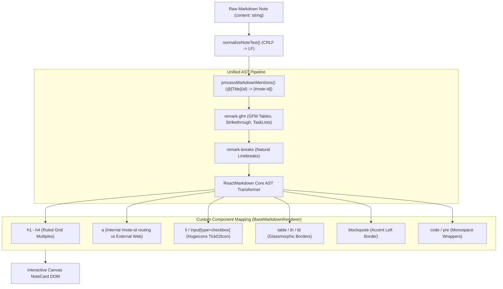

# DiaryNote Markdown Engine & Rendering Architecture

This document provides a comprehensive technical breakdown of the **Markdown Engine**, **AST Parsing Pipeline**, **Custom Component Rendering**, **Live Text Engine**, **Slash Commands**, **Bidirectional Mention Graph**, and **Ruled Paper Physics** in DiaryNote.

---

## 1. Architectural Overview & Design Philosophy

DiaryNote adopts a **Plain Markdown Single Source of Truth** philosophy:
* **Storage Independence**: Notes are stored in IndexedDB and Rust SQLite as pure canonical UTF-8 Markdown text (`note.content: string`). There are no proprietary AST binary blobs or opaque rich-text JSON documents.
* **Dual-View Ergonomics**: Notes seamlessly transition between a live **Textarea Markdown Editor** (accelerated by shortcut wrappers, smart indentation, slash commands, and `@` mention autocomplete) and an interactive **Rendered Markdown View** (supporting clickable note back-links, thematic checkboxes, tables, and typography).
* **Zero Nested Scrollbars**: Note cards calculate their bounding dimensions dynamically based on rendered content (`scrollHeight`), allowing cards on the infinite canvas to breathe without internal clipping or scrollbar clutter.



---

## 2. Parsing Pipeline & AST Transformations

The parsing pipeline is implemented in [`src/components/NoteCard/BaseMarkdownRenderer.tsx`](file:///home/itshimelz/Projects/DiaryNote/src/components/NoteCard/BaseMarkdownRenderer.tsx) and utilizes `react-markdown` v10 with custom Remark plugins and custom node resolvers.

### 2.1 AST Plugins
1. **`remark-gfm` (v4.0.1)**:
   * **Task Lists**: Parses `- [ ]` and `- [x]` into GitHub task list AST nodes (`contains-task-list`, `task-list-item`).
   * **GFM Tables**: Parses standard GitHub markdown pipe tables (`| col | col |`).
   * **Strikethrough**: Enables `~~strikethrough~~` tokens (`del` nodes).
   * **Autolinks**: Automatically detects raw URLs (`https://...`) as clickable link nodes.
2. **`remark-breaks` (v4.0.0)**:
   * Converts single newline characters (`\n`) into `<br />` breaks, ensuring that note-taking linebreaks behave naturally without requiring double-space trailing hacks.

### 2.2 Text Pre-Processing
Before the content enters the Remark AST parser, two preprocessing passes occur in `useMemo`:
* **Line Ending Normalization** (`normalizeNoteText` in [`src/utils/noteTextEngine.ts`](file:///home/itshimelz/Projects/DiaryNote/src/utils/noteTextEngine.ts)):
  ```typescript
  export const normalizeNoteText = (value: string | undefined): string =>
    (value || '').replace(/\r\n?/g, '\n');
  ```
  Converts Windows `\r\n` and legacy Mac `\r` into standard Unix `\n` to ensure consistent selection ranges and cursor calculations.
* **Mention Pre-Processing** (`processMarkdownMentions` in [`src/utils/markdownMention.ts`](file:///home/itshimelz/Projects/DiaryNote/src/utils/markdownMention.ts)):
  Scans for `@[Title](explicitId)` or `@[Title]` patterns and rewrites them into internal hash anchors:
  ```typescript
  content.replace(/@\[([^\]]+)\](?:\(([^)]+)\))?/g, (match, title, explicitId) => {
    // Resolves note ID via ID Map or Title Index
    return `[${targetNote.title}](#note-${targetNote.id})`;
  });
  ```

---

## 3. Custom Component Mapping & Rendering Engine

[`BaseMarkdownRenderer.tsx`](file:///home/itshimelz/Projects/DiaryNote/src/components/NoteCard/BaseMarkdownRenderer.tsx) replaces standard HTML tags with specialized components:

### 3.1 Internal Note Routing vs External Links (`<a>`)
The custom link renderer intercepts internal `#note-{id}` anchors:
```tsx
a: ({ href, children }) => {
  if (href?.startsWith('#note-')) {
    const targetNoteId = href.replace('#note-', '');
    return (
      <button
        type="button"
        onClick={(e) => {
          e.stopPropagation();
          onNavigateToNote?.(targetNoteId);
        }}
        className={`inline font-medium ${themeConfig.linkColor} hover:underline cursor-pointer`}
      >
        {children}
      </button>
    );
  }
  return (
    <a
      href={href}
      target="_blank"
      rel="noopener noreferrer"
      className={`${themeConfig.linkColor} hover:underline inline`}
      onClick={(e) => e.stopPropagation()}
    >
      {children}
    </a>
  );
}
```
* **Behavior**: Clicking an internal link halts event propagation, pans the infinite canvas camera smoothly to the target note, and brings it into focus.

### 3.2 Custom Checkbox & Task List Items (`<li>`, `<input type="checkbox">`)
Rather than rendering default browser checkboxes:
* Custom `input[type="checkbox"]` renders a tactile monochromatic square with the Hugeicons `Tick02Icon`.
* The `li` wrapper detects `isTaskList` (`task-list-item`), stripping default disc markers (`list-none`) and aligning the checkbox vertically with the first text line.

### 3.3 Tables, Blockquotes, and Code
* **Tables**: Wrapped in an `overflow-x-auto` container with glassmorphic borders (`border-slate-300/60 dark:border-slate-700/60`) and shaded header cells (`th`).
* **Blockquotes**: Rendered with an accent left border (`border-l-3 border-blue-500/70 pl-3 italic opacity-95`).
* **Code & Pre**: Clean monospace styles (`font-mono`, `text-[0.92em]`, `whitespace-pre-wrap`, `select-text`).

---

## 4. Ruled Lined Paper Physics & Baseline Alignment

DiaryNote features authentic stationery paper themes (`ruled` and `ruled-dark`). For text to align with repeating horizontal notebook lines, strict mathematical alignment rules are applied.

### 4.1 CSS Grid & Variable Definition
In [`src/index.css`](file:///home/itshimelz/Projects/DiaryNote/src/index.css):
* Repeating linear gradient generates subtle notebook rules at `--ruled-line-height` (default `28px`).
* Dynamic line heights match font size classes:
  * `text-xs` $\rightarrow$ `22px`
  * `text-sm` $\rightarrow$ `24px`
  * `text-base` $\rightarrow$ `28px`
  * `text-lg` $\rightarrow$ `32px`
  * `text-xl` $\rightarrow$ `36px`

### 4.2 Heading Baseline Multipliers
In `.ruled-text-alignment`:
* Standard paragraphs, lists, and quotes enforce `line-height: var(--ruled-line-height, 28px) !important;`.
* Headings (`h1`) enforce exact double-line baselines:
  ```css
  .ruled-text-alignment h1 {
    line-height: calc(var(--ruled-line-height, 28px) * 2) !important;
  }
  ```
* This ensures that headings never push subsequent text out of alignment with the notebook lines.

---

## 5. Live Markdown Editor Engine (`noteTextEngine.ts`)

When a user edits a note, [`NoteCard/index.tsx`](file:///home/itshimelz/Projects/DiaryNote/src/components/NoteCard/index.tsx) mounts a dynamic textarea powered by [`noteTextEngine.ts`](file:///home/itshimelz/Projects/DiaryNote/src/utils/noteTextEngine.ts).

### 5.1 Formatting Wrappers & Shortcuts (`applyMarkdownFormatting`)
Supports instant keyboard shortcuts (`Ctrl+B`, `Ctrl+I`, `Ctrl+Shift+X`, `Ctrl+E`, `Ctrl+K`) with automatic wrap/unwrap toggling:

| Shortcut | Format | Prefix / Suffix | Default Placeholder |
| :--- | :--- | :--- | :--- |
| `Ctrl+B` / `Cmd+B` | Bold | `**` ... `**` | `bold text` |
| `Ctrl+I` / `Cmd+I` | Italic | `*` ... `*` | `italic text` |
| `Ctrl+Shift+X` | Strikethrough | `~~` ... `~~` | `strikethrough text` |
| `Ctrl+E` / `Ctrl+\`` | Inline Code | `` ` `` ... `` ` `` | `code` |
| Shortcut Menu | Code Block | ```` ```\n ```` ... ```` \n``` ```` | `code block` |
| Shortcut Menu | Blockquote | `> ` ... ` ` | `quote` |
| `Ctrl+K` | Link | `[` ... `](url)` | `link text` |

* **Toggle Intelligence**: If selected text is already wrapped in the prefix/suffix tokens, executing the shortcut strips the formatting instead of double-wrapping.

### 5.2 Smart List Continuation (`handleSmartEnterList`)
Pressing `Enter` inspects the line preceding the cursor:
1. **Numbered Lists (`1. `, `  2. `)**: Parses current number, increments by 1 (`3. `), and maintains current indentation level.
2. **Checklists (`- [ ] `, `* [x] `)**: Automatically generates a new blank `- [ ] ` checkbox on the next line.
3. **Bullet Lists (`- `, `* `, `+ `)**: Continues bullet items with matching indentation.
4. **List Termination**: If `Enter` is pressed on an empty list item, the prefix is cleared, terminating the list.

### 5.3 Tab / Shift+Tab Indentation
* `Tab`: Inserts 2 spaces (`  `) at cursor position.
* `Shift+Tab`: Strips up to 2 leading spaces from the current line.

---

## 6. Slash Commands & Autocomplete (`SlashCommandMenu.tsx`)

Typing `/` in an empty line or after a space opens the contextual **Slash Command Menu**:
* **Headings**: `/h1`, `/h2`, `/h3`
* **Lists**: `/todo` (`- [ ] `), `/bullet` (`- `), `/number` (`1. `)
* **Blocks**: `/callout` (`> `), `/code` (```` ``` ````), `/divider` (`---`)
* **Utilities**: `/date` (inserts current localized date/time stamp)
* **AI Auto-Tagging**: `/autotag` (calls AI service to analyze content and append up to 3 tags: `**Tags:** #tag1 #tag2`)
* **Collision Detection**: Features parent boundary clamping and flips upward if rendering near the bottom edge of the card.

---

## 7. Bidirectional Mentions & Graph System (`markdownMention.ts`)

DiaryNote features an Obsidian-style bi-directional linking system:
1. **Trigger & Insertion**: Typing `@` triggers [`MentionAutocomplete.tsx`](file:///home/itshimelz/Projects/DiaryNote/src/components/MentionAutocomplete.tsx), inserting `@[Target Title](target-note-id)`.
2. **Connection Extraction (`extractNoteConnections`)**:
   * Scans all notes across the canvas.
   * Redacts unauthenticated locked notes to prevent memory/metadata leaks.
   * Constructs directed connection edges (`fromId`, `toId`, `toTitle`) to render canvas connection lines and back-links.

---

## 8. Dual-Mode Checklist GUI Synchronization (`NoteChecklist.tsx`)

In addition to the standard Markdown view, users can switch the note card mode to **Checklist Mode**:
* **Parsing (`parseItemsFromContent`)**: Extracts `# Headings` and `- [ ]` / `- [x]` items from raw markdown text into reactive objects:
  ```typescript
  interface ChecklistItem {
    id: string;
    text: string;
    completed: boolean;
    isHeading?: boolean;
    headingLevel?: number;
  }
  ```
* **Bi-directional Sync (`syncBackToContent`)**:
  Toggling a checkbox or editing text regenerates standard Markdown:
  ```typescript
  const markdown = updatedItems
    .map((item) => {
      if (item.isHeading) {
        return `${'#'.repeat(item.headingLevel || 1)} ${item.text}`;
      }
      return `- [${item.completed ? 'x' : ' '}] ${item.text}`;
    })
    .join('\n');
  onChangeContent(markdown);
  ```
* **Smart Markdown within Checklists**: Each task item utilizes [`SmartMarkdownText.tsx`](file:///home/itshimelz/Projects/DiaryNote/src/components/NoteCard/SmartMarkdownText.tsx) to render inline bold, italics, code, and `@` note links directly inside task rows.

---

## 9. Performance & Architecture Summary

| Component | Responsibility | Performance Strategy |
| :--- | :--- | :--- |
| [`BaseMarkdownRenderer.tsx`](file:///home/itshimelz/Projects/DiaryNote/src/components/NoteCard/BaseMarkdownRenderer.tsx) | AST transformation & custom DOM rendering | `React.memo`, memoized Remark plugin arrays, fast-path bypass for plain inline text. |
| [`NoteMarkdownView.tsx`](file:///home/itshimelz/Projects/DiaryNote/src/components/NoteCard/NoteMarkdownView.tsx) | Card Markdown Preview adapter | Isolates note props to prevent canvas-wide re-renders during panning. |
| [`NoteChecklist.tsx`](file:///home/itshimelz/Projects/DiaryNote/src/components/NoteCard/NoteChecklist.tsx) | Structured task GUI & 2-way sync | `isInternalChangeRef` bypasses redundant re-parsing loops. |
| [`noteTextEngine.ts`](file:///home/itshimelz/Projects/DiaryNote/src/utils/noteTextEngine.ts) | Formatting, smart enter, height auto-expansion | Pure function transforms with zero DOM allocations. |
| [`markdownMention.ts`](file:///home/itshimelz/Projects/DiaryNote/src/utils/markdownMention.ts) | Graph connection mapping & `@` links | $O(N)$ title/id Map indexing with auth privacy boundary checks. |
