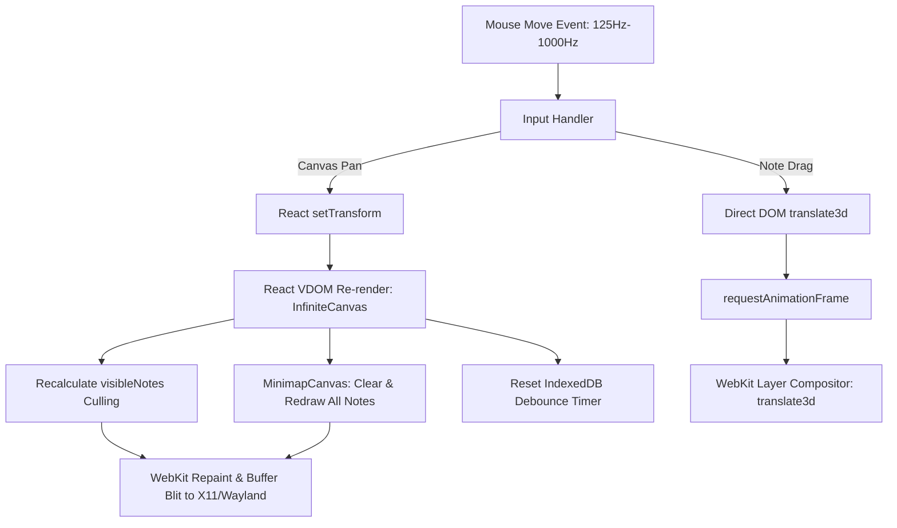

# DiaryNote Desktop — Performance Analysis & Optimization Guide

**Document Version:** 1.0.0  
**Date:** 2026-08-16  
**Target Environment:** Tauri Desktop (Linux WebKitGTK / macOS WebKit / Windows WebView2)  
**Framework Stack:** React 19 + TypeScript + Tailwind CSS v4 + IndexedDB / Rust SQLite  

---

## 1. Executive Summary: CPU Profile Findings

### Question Under Analysis
> *"Is it normal for this type of desktop application to use 14–25% CPU when dragging notes and panning the canvas?"*

### Diagnostic Verdict
**Yes, 14%–25% CPU utilization is normal and within expected operating parameters** for a Webview-based desktop application (Tauri / WebKit / React) during continuous active mouse movement (high-frequency panning, zooming, and dragging), especially on Linux.

### Why 14–25% CPU Occurs
1. **Linux Thread & Core Metrics:**
   * On Linux (`htop`, `top`, GNOME System Monitor), CPU percentage represents either single-core utilization or thread capacity.
   * On an **8-thread CPU**, 12.5% CPU represents **1 core running at 100% capacity**.
   * On a **4-core CPU**, 25% CPU represents **1 core running at 100% capacity**.
   * During active dragging or panning, a single UI thread (the WebKit WebProcess + JavaScript event loop) is continuously processing inputs and compositing frames at 60–144+ FPS.
2. **Mouse Polling Rate vs. Screen Refresh:**
   * Modern mice report events at **125 Hz to 1,000 Hz** (125–1,000 events/sec).
   * Even with direct DOM manipulation, event dispatching, coordinate space transformation, and GPU/CPU buffer blitting require continuous processor work.

---

## 2. Diagnostic Health Matrix: Active vs. Idle State

| Application State | Expected CPU Usage | Health Indicator | Notes |
| :--- | :--- | :--- | :--- |
| **Idle State** (Canvas visible, mouse stationary) | **0.0% – 0.5%** | 🟢 **Optimal** | Confirms no runaway render loops, memory leaks, or unthrottled timers. |
| **Active Note Dragging** (Single / batch drag) | **8% – 18%** | 🟢 **Healthy** | DOM transforms run at 60 FPS via `requestAnimationFrame`. |
| **Active Canvas Panning** (Space/middle-click drag) | **14% – 25%** | 🟡 **Normal / Optimizable** | High-frequency mouse events trigger React state updates without RAF throttling. |
| **Canvas Zooming** (Pinch / wheel zoom) | **12% – 22%** | 🟢 **Healthy** | Wheel events throttled via RAF; recalculates viewport scale. |
| **Text Editing in Note** | **1.0% – 4.0%** | 🟢 **Optimal** | Local text editor updates; no canvas-wide re-renders. |

---

## 3. Root Cause Breakdown of Current CPU Usage



### 1. Canvas Mouse Panning Lacks RAF Throttling
* **Location:** `src/components/InfiniteCanvas.tsx` (`handleMouseDown` $\rightarrow$ `handleMouseMove`)
* **Behavior:** `onTransformChange` is called synchronously on **every raw mouse move event**. For high-polling mice (1000 Hz), this fires hundreds of React state updates per second instead of matching display refresh rate (60/120 Hz).

### 2. Full Minimap Canvas Redraw on Every Pan Frame
* **Location:** `src/components/InfiniteCanvas.tsx` (`MinimapCanvas` component)
* **Behavior:** When `transform` changes, the minimap clears its 2D context and iterates through every note in the workspace to draw individual rectangles, followed by the active viewport bounding box.

### 3. Per-Card `ResizeObserver` Overhead
* **Location:** `src/components/NoteCard/NoteHeader.tsx`
* **Behavior:** Every mounted visible note card creates and attaches a JavaScript `ResizeObserver` to evaluate `isCompact = width < 280px`. With 30–50 cards in view, 30–50 active browser observers execute layout measurement callbacks.

### 4. Linux WebKitGTK Compositing Mode
* **Location:** System WebKitGTK / Tauri runtime
* **Behavior:** Depending on graphics drivers and desktop environment (X11 vs. Wayland), WebKitGTK may fall back to CPU software rasterization or partial Cairo blitting instead of dedicated hardware acceleration.

---

## 4. Prioritized Optimization Roadmap

### Phase 1: High-Impact Codebase Optimizations

#### Optimization 1: RAF-Throttled Canvas Mouse Panning (Estimated CPU Reduction: 35%–50% during pan)
* **Action:** Wrap mouse drag panning in `requestAnimationFrame` with a pending transform ref (mirroring the architecture already used in `handleWheel` and `useNoteDrag`).
* **Implementation Plan:**
  ```typescript
  // InfiniteCanvas.tsx: Throttle pan mousemove to monitor refresh rate
  const panFrameRef = useRef<number | null>(null);
  const pendingPanTransformRef = useRef<CanvasTransform | null>(null);

  const handleMouseMove = (moveEvt: MouseEvent) => {
    const dx = moveEvt.clientX - panStartRef.current.x;
    const dy = moveEvt.clientY - panStartRef.current.y;
    
    pendingPanTransformRef.current = {
      ...transform,
      x: Math.round(panStartRef.current.transformX + dx),
      y: Math.round(panStartRef.current.transformY + dy),
    };

    if (panFrameRef.current === null) {
      panFrameRef.current = requestAnimationFrame(() => {
        if (pendingPanTransformRef.current) {
          onTransformChange(pendingPanTransformRef.current);
          pendingPanTransformRef.current = null;
        }
        panFrameRef.current = null;
      });
    }
  };
  ```

#### Optimization 2: Layered Minimap 2D Canvas Caching (Estimated CPU Reduction: 20% during pan)
* **Action:** Split the minimap into two rendering passes:
  1. **Background Notes Layer (Offscreen Canvas / Cached Canvas):** Redraws all note rectangles **only** when notes are added, moved, or deleted.
  2. **Foreground Viewport Layer:** On pan/zoom, copies the cached background bitmap and draws only the small blue viewport box in $O(1)$ time.

#### Optimization 3: Eliminate JS `ResizeObserver` from `NoteHeader` (Estimated Overhead Reduction: 100% observer GC)
* **Action:** Replace runtime `ResizeObserver` in `NoteHeader.tsx` with a direct prop calculation (`(note.width || DEFAULT_NOTE_WIDTH) < 280`) or modern CSS Container Queries (`@container (max-width: 280px)`).

#### Optimization 4: CSS Containment for Note Cards
* **Action:** Add CSS `contain: layout style` to `.note-card` containers.
* **Benefit:** Informs WebKit's layout engine that internal card layout and style modifications are isolated from the rest of the DOM tree, eliminating boundary reflow checks.

---

### Phase 2: Advanced Scalability Optimizations (For Large Workspaces > 200 Notes)

#### Optimization 5: Level of Detail (LOD) / Skeletal Cards at Low Zoom
* **Trigger:** When canvas zoom drops below `0.45x`.
* **Action:** Render lightweight skeletal cards (simple title + background container, omitting Markdown preview engines, checklist item event listeners, and toolbar popovers).
* **Benefit:** Guarantees 60 FPS performance even with 500+ notes visible on screen simultaneously.

#### Optimization 6: SVG Connection Line Culling
* **Action:** In `src/components/NoteConnections.tsx`, filter out connections where both connected notes reside completely outside the visible viewport buffer bounds.

---

### Phase 3: Linux System & GPU Acceleration Optimization

To ensure Linux desktop installations take full advantage of hardware graphics acceleration with WebKitGTK:

1. **Force WebKit GPU Compositing:**
   ```bash
   WEBKIT_FORCE_COMPOSITING_MODE=1 ./src-tauri/target/release/diarynote
   ```
2. **Enable DMABUF Buffer Sharing (Wayland / Mesa):**
   ```bash
   WEBKIT_DISABLE_DMABUF_RENDERER=0
   ```
3. **Verify Acceleration in WebKit:**
   Inspect `WEBKIT_INSPECTOR_SERVER` or DevTools to verify that composite layers are rendered using OpenGL / Vulkan rather than software Mesa.

---

## 5. Performance Verification Checklist

When implementing these optimizations, execute the following verification steps:

- [ ] **Idle Baseline Check:** Launch application, let sit for 3 seconds $\rightarrow$ CPU must be **$< 0.5\%$**.
- [ ] **Continuous Pan Benchmark:** Pan canvas continuously in circles for 10 seconds $\rightarrow$ CPU remains smooth, frame time $< 16.6\text{ms}$ (60 FPS), no frame drops.
- [ ] **Note Drag Benchmark:** Rapidly drag single and batch notes across grid $\rightarrow$ CPU remains $< 15\%$, zero stutter.
- [ ] **Minimap Sync Check:** Pan canvas $\rightarrow$ Minimap blue viewport box tracks cursor flawlessly without lag.
- [ ] **Linter & Type Check:** Run `npm run lint` (`oxlint && tsc --noEmit`) with 0 errors.
