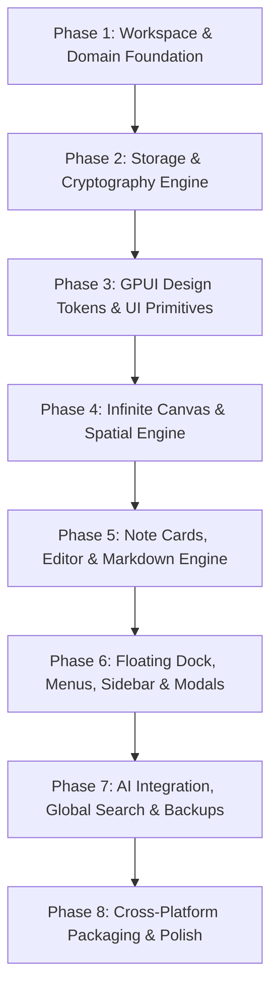

# Pure Rust & GPUI Native Migration Master Plan

**Target Architecture:** Pure Cross-Platform Rust Application with GPUI (Zed Industries GPU Engine)  
**Target Platforms:** Linux (Wayland / X11 via Vulkan), macOS (Metal), Windows (DirectX / DirectComposition)  
**Paradigm:** Clean Modular Architecture / Hexagonal Architecture (Cargo Workspace)  
**Design System:** Monochromatic Desktop Tokens (`rounded-sm` [4px], 1.5px Hugeicons, Light & Dark themes)

---

## 1. Executive Summary & Goals

This document specifies the complete transition of the desktop application from a **Tauri v2 + React 19 + TypeScript + Webview** architecture to a **100% Native Pure Rust application powered by GPUI**.

### Key Architectural Objectives:
1. **Zero Webview Overhead:** Eliminate Chromium/WebKit runtimes, Node.js, Vite, npm, and IPC serialization delays.
2. **Sub-millisecond Latency & 120+ FPS Rendering:** Direct GPU shader-backed rendering via GPUI with instant frame dispatch.
3. **Decoupled Modular Architecture:**
   - **Domain Layer (`crates/domain`)**: 100% pure Rust entities, spatial canvas mathematics, and abstract repository traits. Zero UI or DB dependencies.
   - **Storage Layer (`crates/storage`)**: SQLite 3 WAL engine, transactional batch writes, full-text search (FTS5), and JSON backup exporter.
   - **Crypto Layer (`crates/crypto`)**: Argon2id KDF, AES-256-GCM envelope encryption, and `Zeroize` memory hygiene for locked notes.
   - **AI Layer (`crates/ai`)**: Local/remote LLM streaming providers (Ollama, OpenAI, Gemini, Claude).
   - **UI Layer (`crates/ui`)**: Reusable atomic primitives (`Button`, `Input`, `Dialog`, `Switch`), molecules (`NoteHeader`, `NoteToolbar`), organisms (`NoteCard`, `InfiniteCanvas`), and modal overlays.
   - **App Layer (`crates/app`)**: Application lifecycle, multi-windowing, state orchestration, and unidirectional action dispatching.
4. **100% Visual & Behavioral Fidelity:** Maintain the exact spatial infinite canvas, note card resizing, checklists, markdown rendering, bottom control dock, modals, keyboard shortcuts, and theme switcher.

---

## 2. Cargo Workspace Architecture

```
DiaryNote/
├── Cargo.toml                  # Root workspace configuration
├── crates/
│   ├── domain/                 # Pure domain models, R-Tree spatial logic, traits
│   ├── storage/                # SQLite persistence, migrations, backup engine
│   ├── crypto/                 # Argon2id, AES-256-GCM, Zeroize memory safety
│   ├── ai/                     # AI clients (Gemini, OpenAI, Claude, Ollama)
│   ├── ui/                     # GPUI design tokens, atomic components, views
│   └── app/                    # Main executable, window lifecycle, state store
└── assets/                     # Fonts, icons, themes, and sound assets
```

### Dependency Flow & Boundary Rules
- `domain` has **zero dependencies** on other workspace crates.
- `storage`, `crypto`, `ai`, and `ui` only depend on `domain`.
- `app` wires all crates together, orchestrates state transitions, and manages background tasks.

---

## 3. Phase-by-Phase Migration Roadmap



---

### Phase 1: Cargo Workspace & Pure Domain Modeling
**Goal:** Establish the multi-crate workspace and migrate all core models, types, and spatial geometry into pure, unit-tested Rust code.

- **Task 1.1: Workspace Setup**
  - Create root `Cargo.toml` workspace and crate folders (`domain`, `storage`, `crypto`, `ai`, `ui`, `app`).
  - Configure shared compiler flags, lints, and profile optimizations (`opt-level = 3`, `lto = "thin"`).
- **Task 1.2: Domain Models & Entities**
  - Implement `Note`, `NoteId`, `Point2D`, `Size2D`, `ColorTheme`, `JournalEntry`, `GroupFrame`, `ConnectionEdge`, and `Tag`.
  - Add Serde serialization/deserialization with strict validation.
- **Task 1.3: Spatial Canvas Engine & Geometry**
  - Implement 2D coordinate transforms: `screen_to_canvas(point, camera)` and `canvas_to_screen(point, camera)`.
  - Implement Axis-Aligned Bounding Box (AABB) intersection algorithms for dynamic rubber-band marquee selection.
  - Implement R-Tree spatial indexing (`rstar` or custom spatial tree) for zero-latency viewport culling.
- **Task 1.4: Repository Traits (Ports)**
  - Define `NotesRepository`, `VaultRepository`, `SettingsRepository`, `BackupService`, and `AiService` traits.
- **Verification:** Run `cargo test -p domain` with 100% coverage on spatial math and model serialization.

---

### Phase 2: Storage Engine, Migrations & Cryptography
**Goal:** Implement SQLite database persistence, FTS5 full-text indexing, and AES-256-GCM envelope encryption without Webview IPC.

- **Task 2.1: SQLite Repository (`crates/storage`)**
  - Implement `SqliteNotesRepository` using `rusqlite` in WAL mode with connection pooling.
  - Build migration runner (`V1_initial_schema.sql`, `V2_fts5_indexing.sql`, `V3_groups_edges.sql`).
  - Implement batch write transactions with dirty-buffer debouncing.
- **Task 2.2: Dual-Tier Full-Text Search (FTS5)**
  - Implement SQLite FTS5 table with BM25 ranking, prefix matching, and tag filtering.
- **Task 2.3: Cryptography Engine (`crates/crypto`)**
  - Implement Argon2id password-based key derivation (KDF) with high memory cost parameters.
  - Implement AES-256-GCM envelope encryption for locked notes and credentials.
  - Wrap sensitive in-memory byte buffers with `zeroize::Zeroizing` to protect against RAM inspection.
- **Task 2.4: Backup & Staged Import Engine**
  - Implement JSON snapshot backup and ZIP archive generation (`rusqlite::backup` + manifest).
  - Implement staged import parsing with duplicate ID detection and conflict resolution.
- **Verification:** Run `cargo test -p storage -p crypto` verifying ACID compliance and crypto roundtrips.

---

### Phase 3: GPUI Design Tokens & Atomic UI Primitives
**Goal:** Build the single-source-of-truth UI primitive foundation in GPUI adhering to DiaryNote’s monochromatic design system.

- **Task 3.1: Design Tokens & Styling DSL (`crates/ui/src/tokens.rs`)**
  - Define light and dark color palettes, border tokens, elevation shadows, and geometry constants (`rounded-sm = px(4.0)`).
  - Create extension traits for `gpui::Div` to support fluent style composition.
- **Task 3.2: Iconography Integration**
  - Build Hugeicons SVG renderer / rasterized glyph loader (1.5px stroke weight).
- **Task 3.3: Atomic UI Primitives (`crates/ui/src/primitives/`)**
  - `Button` & `IconButton`: Primary, secondary, ghost, danger variants with keyboard focus states.
  - `Input` & `Textarea`: Bordered, focus rings, placeholder, clearable action.
  - `Checkbox` & `Switch`: Accessible toggle states with smooth animations.
  - `Badge` & `Kbd`: Monochromatic metadata chips and shortcut key badges.
  - `Dialog` & `Modal`: Backdrop overlay, focus trapping, portal mounting, and `Escape` key dismissal.
  - `Menu`, `MenuItem`, `MenuDivider`: Keyboard-navigable popup and context menus.
  - `Tabs` & `SegmentedControl`: Monochromatic pill active indicators.
- **Verification:** Build a GPUI component preview window (`cargo run -p ui --example component_gallery`).

---

### Phase 4: Native Infinite Canvas & Interaction Engine
**Goal:** Replicate the 2D infinite spatial canvas with native GPU performance.

- **Task 4.1: Camera & Viewport View (`crates/ui/src/views/canvas_view.rs`)**
  - Implement 2D infinite panning (Middle-click drag, Spacebar drag, Trackpad two-finger scroll).
  - Implement smooth cursor-centered zooming (Ctrl + Wheel, Pinch gesture) with `[0.2x, 3.0x]` clamping.
  - Implement infinite dot/grid background rendering via GPU shader or batched lines.
- **Task 4.2: Spatial Viewport Culling**
  - Query spatial R-Tree on camera transform change to only render cards currently within the viewport + overscan margin.
- **Task 4.3: Rubber-Band Marquee Selection**
  - Mouse drag on empty canvas renders dynamic selection rectangle and updates multi-selected note IDs at 120 FPS.
- **Task 4.4: Card Dragging & 60 FPS Resizing**
  - Immediate direct transforms on mouse move with grid snapping (`snap_to_grid`).
  - Batch drag operations when multiple notes are selected.
- **Verification:** Benchmark canvas with 500+ simulated notes maintaining solid 60/120 FPS during panning and zooming.

---

### Phase 5: Note Cards, Text Editing & Markdown Engine
**Goal:** Implement note cards, checklist tasks, and markdown rendering.

- **Task 5.1: Note Card Structure (`crates/ui/src/components/note_card.rs`)**
  - Header: Drag handle, note title, mood indicator, pin icon, lock badge, more menu.
  - Content: Rich text editor with natural auto-expanding height (zero inner scrollbars).
  - Footer/Toolbar: Color theme picker, checklist toggle, tag list, AI action trigger.
- **Task 5.2: Text Input & Checklist Engine**
  - Implement native GPUI text input handling with multi-line wrap and IME support.
  - Interactive checklists (`[ ]` / `[x]`) with click toggle and strikethrough styling.
- **Task 5.3: Markdown Rendering**
  - Integrate `pulldown-cmark` to parse headings, bold, italic, inline code, links, and blockquotes into native GPUI elements.
- **Task 5.4: Slash Command Menu (`/`) & `@` Mentions**
  - Floating popup anchored to cursor position with keyboard navigation (`ArrowUp`/`ArrowDown`/`Enter`).
- **Verification:** Create, type, format markdown, and toggle checklist items in note cards.

---

### Phase 6: Floating Control Dock, Sidebar & Modals
**Goal:** Port all navigation, bottom command dock, sidebar note list, and desktop modal dialogs.

- **Task 6.1: Bottom Control Dock (`crates/ui/src/components/control_dock.rs`)**
  - Docked tools: New Note, New Journal Entry, Zoom Controls, Theme Switcher, Settings trigger.
  - Integrated Batch Action Bar: Smoothly expands upward when 2+ notes are selected.
- **Task 6.2: Notes Sidebar Drawer (`crates/ui/src/views/notes_sidebar.rs`)**
  - Search filter, tag badges, virtualized list of note rows, and instant canvas pan-to-note.
- **Task 6.3: Desktop Modals & Overlays (`crates/ui/src/views/modals/`)**
  - `SecurityModal`: Master passcode setup, unlock dialog, recovery key generation.
  - `CanvasSettingsModal`: 2-column preferences window (Appearance, Storage, AI, Shortcuts).
  - `SearchModal` (Ctrl+K): Global instantaneous FTS5 search with keyboard navigation.
  - `JournalCalendarModal`: Streak counter and monthly daily entry calendar grid.
  - `ImportPreviewModal`: Staged backup preview with conflict resolution selectors.
- **Verification:** Test all keyboard shortcuts (`Ctrl+K`, `Ctrl+N`, `Ctrl+L`, `Ctrl+,`, `Esc`) and modal flows.

---

### Phase 7: State Store, AI Services & Background Persistence
**Goal:** Implement unidirectional application state management and connect AI LLM services.

- **Task 7.1: Application State Controller (`crates/app/src/state.rs`)**
  - Unidirectional action dispatcher (`dispatch(action, cx)`).
  - Full Undo/Redo history stack for canvas actions and text edits.
  - Dirty-state settlement: Status bar shows "Saving..." during background write and "Saved" on confirmation.
- **Task 7.2: AI Streaming Integration (`crates/ai`)**
  - Native HTTP client (`reqwest` with `rustls`) for streaming completions.
  - Summarization, tone conversion, task extraction, and smart tagging actions.
- **Verification:** Verify undo/redo across note moves, deletions, and edits; test AI streaming output.

---

### Phase 8: Cross-Platform Packaging & Release Pipeline
**Goal:** Package native desktop binaries for Linux, macOS, and Windows.

- **Task 8.1: Platform Integration**
  - **macOS**: Native transparent titlebar, traffic light positioning, `.app` bundle, universal binary (`aarch64` + `x86_64`).
  - **Linux**: AppImage, `.deb`, and Flatpak packages with Wayland/X11 Vulkan drivers.
  - **Windows**: Single `.exe` and MSI installer via WiX/InnoSetup.
- **Task 8.2: CI/CD Workflow**
  - GitHub Actions matrix build running `cargo check`, `cargo test`, `cargo clippy`, and release packaging across all 3 OS platforms.
- **Verification:** Verify native binary launches and runs cleanly on Linux, macOS, and Windows with <40 MB RAM usage.

---

## 4. UI Component Mapping Table (React -> GPUI)

| React Component (Current) | GPUI Crate & Struct | Responsibility |
| :--- | :--- | :--- |
| `src/components/ui/Button.tsx` | `ui::primitives::Button` | Monochromatic action button |
| `src/components/ui/Dialog.tsx` | `ui::primitives::Dialog` | Focus-trapped modal overlay |
| `src/components/ui/Input.tsx` | `ui::primitives::Input` | Text input control with focus rings |
| `src/components/ui/Switch.tsx` | `ui::primitives::Switch` | Accessible toggle switch |
| `src/components/NoteCard/index.tsx` | `ui::components::NoteCardView` | Card layout, drag/resize handles, styling |
| `src/components/NoteCard/NoteHeader.tsx` | `ui::components::NoteHeader` | Note title, pin, lock, mood, and actions |
| `src/components/InfiniteCanvas.tsx` | `ui::views::InfiniteCanvasView` | 2D pan/zoom viewport, marquee selector |
| `src/components/CanvasControls.tsx` | `ui::components::ControlDock` | Floating bottom command dock |
| `src/components/BatchActionBar.tsx` | `ui::components::BatchActionBar` | Top-tier multi-selection dock header |
| `src/components/NotesSidebar.tsx` | `ui::views::NotesSidebarView` | Virtualized note list drawer |
| `src/components/Modals/SecurityModal.tsx` | `ui::views::SecurityModalView` | Passcode setup, unlock, and recovery |
| `src/components/Modals/SearchModal.tsx` | `ui::views::SearchModalView` | Global Ctrl+K instant FTS5 search |
| `src/components/Modals/CanvasSettingsModal.tsx`| `ui::views::SettingsModalView` | 2-column workspace preferences |
| `src/components/StatusBar.tsx` | `ui::components::StatusBar` | Save state, note count, storage indicator |

---

## 5. Architectural Checklist for Review

- [x] Unprefixed, clean modular crate naming (`domain`, `storage`, `crypto`, `ai`, `ui`, `app`).
- [x] Strict separation of concerns (Domain, Storage, Crypto, AI, UI, App).
- [x] Zero Webview / Node.js runtime overhead.
- [x] Direct embedded SQLite persistence (no serialization / IPC bottlenecks).
- [x] Atomic design component architecture in GPUI with single source of truth design tokens.
- [x] Cross-platform native support across Linux, macOS, and Windows.
- [x] 100% preservation of spatial canvas interaction paradigms and visual aesthetic.
