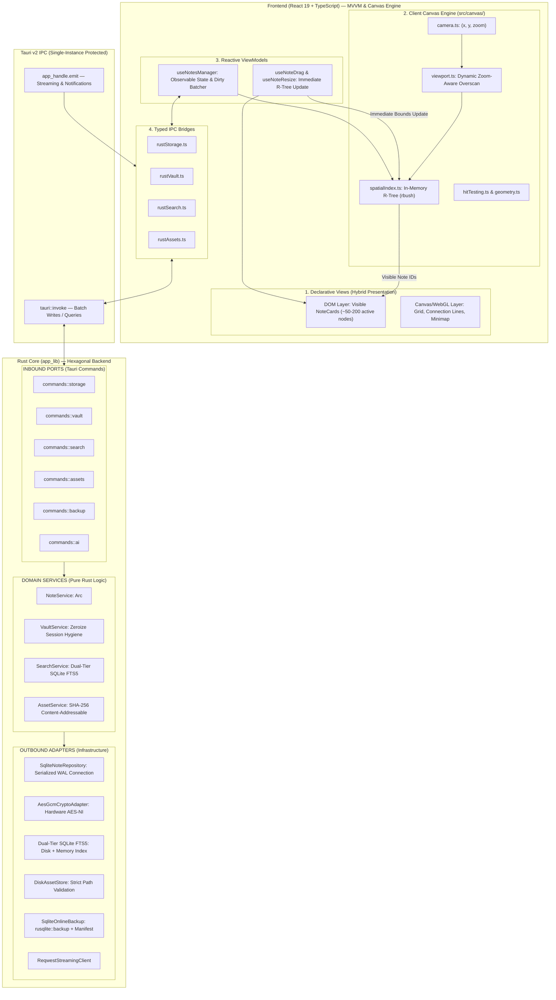

# DiaryNote Desktop — Hybrid MVVM + Hexagonal Native Migration Architecture
## Frozen Architecture Specification (v4.0.0)

**Document Version:** 4.0.0 (Frozen Architecture Baseline)  
**Target Platforms:** Linux (XDG), macOS (Application Support), Windows (AppData/Roaming)  
**Frontend Architecture:** MVVM (React 19 + TypeScript + Custom ViewModels)  
**Canvas Engine:** Dedicated Client Canvas Engine (`src/canvas/`) + Hybrid DOM/Canvas Presentation  
**Spatial Virtualization:** Client In-Memory R-Tree (`rbush`) with Dynamic Zoom-Aware Overscan  
**Backend Architecture:** Hexagonal / Ports & Adapters (`app_lib` Rust Core)  
**Storage & Security:** SQLite 3 (WAL mode, Serialized Connection) + Argon2id/AES-256-GCM + Dual-Tier SQLite FTS5

---

## 1. Core Architectural Separation of Concerns

```text
┌─────────────────────────────────────────────────────────────────────────────┐
│                          DIARYNOTE ARCHITECTURE                             │
├──────────────────────────────┬──────────────────────────────────────────────┤
│ 1. RENDER & INTERACTION      │ React 19 DOM + HTML5 Canvas Layer (Client)   │
│    (Fluid 60/120 FPS Goal)   │ • DOM: NoteCards, Textareas, IME, Controls   │
│                              │ • Canvas: Background Grid, Edge Lines        │
├──────────────────────────────┼──────────────────────────────────────────────┤
│ 2. CANVAS ENGINE             │ src/canvas/ (Client In-Memory Spatial Sub)   │
│    (Zero-IPC Viewport Math)  │ • Camera, Viewport, Hit Testing, Geometry    │
│                              │ • R-Tree Spatial Virtualizer (Dynamic Buffer)│
├──────────────────────────────┼──────────────────────────────────────────────┤
│ 3. PERSISTENCE & SYSTEM      │ Native Rust Core + Embedded SQLite (Backend) │
│    (ACID, Security & Assets) │ • SQLite: Serialized WAL Connection + FTS5   │
│                              │ • Crypto: Argon2id + AES-256-GCM + Zeroize   │
│                              │ • Media: SHA-256 Content-Addressable Store   │
│                              │ • Backup: rusqlite::backup + manifest.json   │
└──────────────────────────────┴──────────────────────────────────────────────┘
```

---

## 2. End-to-End System Architecture



---

## 3. Subsystem Specifications & Engineering Resolutions

### 1. Client Canvas Engine & Immediate R-Tree Synchronization
To maintain a responsive 60/120 FPS interaction target without state desynchronization:
* **Dedicated Module (`src/canvas/`):**
  - `camera.ts`: Zoom/pan matrix calculations and coordinate transformation.
  - `spatialIndex.ts`: In-memory 2D R-Tree (`rbush`).
  - `viewport.ts`: Computes camera frustum with dynamic overscan.
  - `hitTesting.ts`: Point/box intersection queries.
  - `geometry.ts`: Card dimensions, padding, and cluster alignment math.
* **Immediate Synchronization Lifecycle:**
  ```text
  User drags/resizes Note A (60 FPS)
         ↓
  Update React local position state
         ↓
  Update Client R-Tree immediately (Zero stale index window)
         ↓
  Mark Note A dirty in ViewModel
         ↓
  Debounced SQLite batch persistence (500ms)
  ```
  The R-Tree updates immediately during pointer movements and **does not wait for SQLite persistence acknowledgement**.

---

### 2. Dynamic Zoom-Aware Overscan Buffer
Instead of a fixed constant, the spatial virtualization overscan buffer adapts dynamically to camera zoom:
$$\text{overscanX} = \text{clamp}\left(\frac{\text{viewportWidth} \times 0.35}{\text{zoom}}, 300, 1500\right)$$
$$\text{overscanY} = \text{clamp}\left(\frac{\text{viewportHeight} \times 0.35}{\text{zoom}}, 300, 1500\right)$$
* At `zoom = 1.0`: Default buffer is $\sim 500\text{px}$.
* At `zoom = 0.2` (zoomed far out): Buffer scales up in world coordinates to prevent blank pop-in during fast pans.
* At `zoom = 3.0` (zoomed close in): Buffer scales down to avoid mounting unnecessary off-screen cards.

---

### 3. Dual-Tier SQLite FTS5 Search (Standardized on SQLite)
* **Single Technology Choice:** DiaryNote standardizes strictly on **SQLite FTS5** for both disk and memory search tiers.
* **Architecture:**
  1. **Persistent Disk FTS5 (`notes_fts`):** Indexes public notes, titles, tags, and dates with the `trigram` tokenizer.
  2. **Volatile Memory FTS5 (`:memory:`):** When the vault is unlocked with the master passcode, decrypted note plaintexts are indexed into a transient in-memory SQLite FTS5 table.
  3. **Unified Querying:** `SearchService` queries both tables and merges results via BM25 scores.
  4. **Lock Cleanup:** When the vault is locked or timeout expires, the in-memory SQLite connection is dropped and memory reclaimed.

---

### 4. Defensible Cryptography & Memory Hygiene Specification
* **On-Disk Guarantee:** Plaintext vault content is **never intentionally persisted** to the on-disk SQLite database, WAL files, or persistent FTS index.
* **In-Memory Hygiene:** Decrypted content and master keys exist only in the unlocked process memory. Master key structs implement `zeroize::ZeroizeOnDrop` to overwrite key buffers with zeros upon vault lock, timeout, or application exit.
* **Algorithms:** Argon2id (m=64MB, t=3, p=4) / PBKDF2-SHA256 key derivation + AES-256-GCM authenticated encryption.

---

### 5. Authoritative SQLite Database & Asset Pipeline
* **Storage Model:** ACID local persistence with SQLite as the authoritative database alongside a content-addressable `assets/` store:
  ```text
  AppDataDir/
  ├── diarynote.db           # Authoritative SQLite database
  ├── diarynote.db-wal       # Write-Ahead Log
  ├── diarynote.db-shm       # Shared Memory index
  ├── assets/
  │   ├── originals/         # <sha256_hash>.<ext>
  │   └── thumbnails/        # <sha256_hash>_thumb.webp
  ├── backups/               # .diarynote archives
  └── temp/                  # Atomic staging directory
  ```
* **Serialized Connection:** For a single-user desktop application, `SqliteNoteRepository` uses a serialized `Mutex<rusqlite::Connection>` in `AppState`, eliminating connection pool overhead while guaranteeing thread-safe transactional writes.

---

### 6. Multi-Tier Durability & Lifecycle Management
* **Active Typing:** 500ms debounced batch save.
* **Window Close (`WindowEvent::CloseRequested`):** Hard durability boundary. Intercepts close event, flushes all pending dirty notes synchronously to SQLite, and only then calls `app_handle.exit(0)`.
* **Window Blur (`window.onblur`):** Schedules/accelerates the pending debounced flush to minimize exposure.
* **Manual Save (`Ctrl+S` / `Cmd+S`):** Instant synchronous flush with status bar feedback.

---

### 7. Deferred Asset Garbage Collection
* Deleting a note never immediately deletes its referenced image from `assets/originals/` (preventing catastrophic data loss on accidental note deletion or undo).
* An explicit **"Optimize Vault"** maintenance task scans all active SQLite references and safely purges orphaned files older than 7 days.

---

### 8. WAL-Safe Online Backup with Versioned Manifest
* Uses `rusqlite::backup::Backup` to create a point-in-time snapshot of `diarynote.db` without detached WAL corruption.
* Produces a standard `.diarynote` ZIP container containing:
  - `manifest.json`:
    ```json
    {
      "format_version": "1.0.0",
      "app_version": "0.2.0",
      "schema_version": 2,
      "created_at": "2026-08-17T23:00:00Z",
      "note_count": 142,
      "asset_hashes": ["8f4b...", "3a1c..."]
    }
    ```
  - `diarynote.db`: Checkpointed SQLite database snapshot.
  - `assets/`: Referenced image assets.

---

## 4. Phased Implementation Roadmap (Frozen v4.0.0)

| Phase | Milestone Name | Key Subsystems & Deliverables | Verification Gate |
| :--- | :--- | :--- | :--- |
| **Phase 0** | **OS Foundation & Contracts** | Single-instance mutex, AppData path resolver, `NoteRepository` trait, `StorageError` | Single-instance test, AppData resolution across OSs |
| **Phase 1** | **SQLite Storage & Canvas Engine** | `rusqlite` WAL, versioned migrations, atomic `save_batch`, `src/canvas/` R-Tree spatial virtualizer, TS bridge | Unit tests, 10,000 note spatial culling ($< 200$ DOM nodes), close durability drill |
| **Phase 2** | **Asset Store & Protocol** | SHA-256 store, atomic staging, `diarynote-asset://` protocol with strict validation | Path traversal security drill, WebP thumbnail generation |
| **Phase 3** | **Hardware Crypto Vault** | Argon2id + AES-256-GCM, `zeroize` session vault, native rate-limiting | Zero plaintext on disk, memory zeroing on lock |
| **Phase 4** | **Dual-Tier SQLite FTS5 & Graph** | Persistent FTS5 + in-memory FTS5, `pulldown-cmark` Markdown AST backlink parser | Sub-millisecond search, locked note search isolation |
| **Phase 5** | **Online Backup Engine** | SQLite Online Backup API, `.diarynote` ZIP container with `manifest.json` | Backup during active writes, staged restore |
| **Phase 6** | **Streaming AI Gateway** | Native `reqwest` streaming SSE client, encrypted backend credentials | Real-time token streaming, zero key exposure |
| **Phase 7** | **Hardening & Release Polish** | Static analysis, cross-platform validation, AGENTS.md registry updates | `cargo test --all`, `cargo check`, `npm run lint` clean |
